## 简介

FastAPI 是一个用于构建 API 的现代、快速（高性能）的 Web 框架，使用 Python 并基于标准的 Python 类型提示。

- **快速**：极高性能，可与 **NodeJS** 和 **Go** 并肩（归功于 Starlette 和 Pydantic）。[最快的 Python 框架之一](https://fastapi.tiangolo.com/zh/#performance)。
- **高效编码**：功能开发速度提升约 200% ～ 300%。*

- **标准化**：基于（并完全兼容）API 的开放标准：[OpenAPI](https://github.com/OAI/OpenAPI-Specification)（以前称为 Swagger）和 [JSON Schema](https://json-schema.org/)。

```
Flask：
- 老牌框架，简单够用
- 同步，一次处理一个请求
- 需要手写文档

FastAPI：
- 现代框架，AI项目标配
- 支持异步，同时处理多个请求
- 自动生成交互式API文档
- 用Pydantic自动校验数据
```

```
模型推理慢（几秒钟）
如果用同步Flask：
  请求1进来 → 等模型推理 → 返回 → 请求2才能进来
  10个用户同时请求 → 排队等待

用异步FastAPI：
  请求1进来 → 开始推理（等待中）→ 同时处理请求2、3、4...
  10个用户同时请求 → 并发处理
```

[Starlette](https://www.starlette.dev/) 负责 Web 部分。

[Pydantic](https://docs.pydantic.dev/) 负责数据部分。

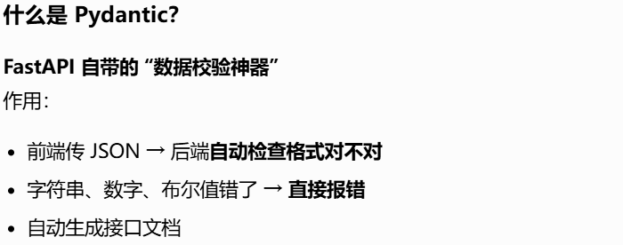

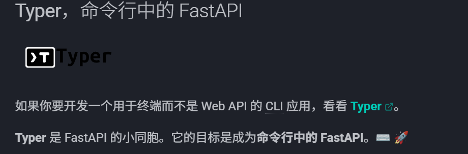

## 安装

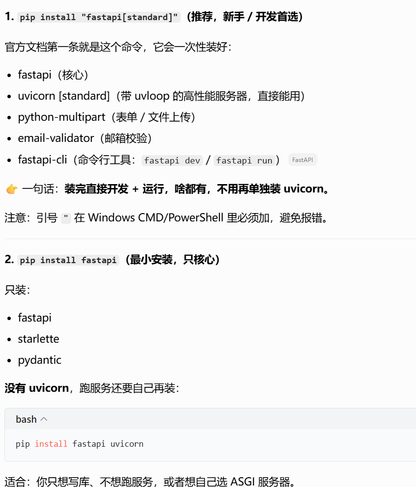

```
from fastapi import FastAPI

app=FastAPI()

@app.get('/')
def read_root():
	return {"hello":"world"}
@app.get("/items/{item_id}")
def read_item(item_id:int,q:str | None=None):
	return{"item_id":item_id,"q":q}
```

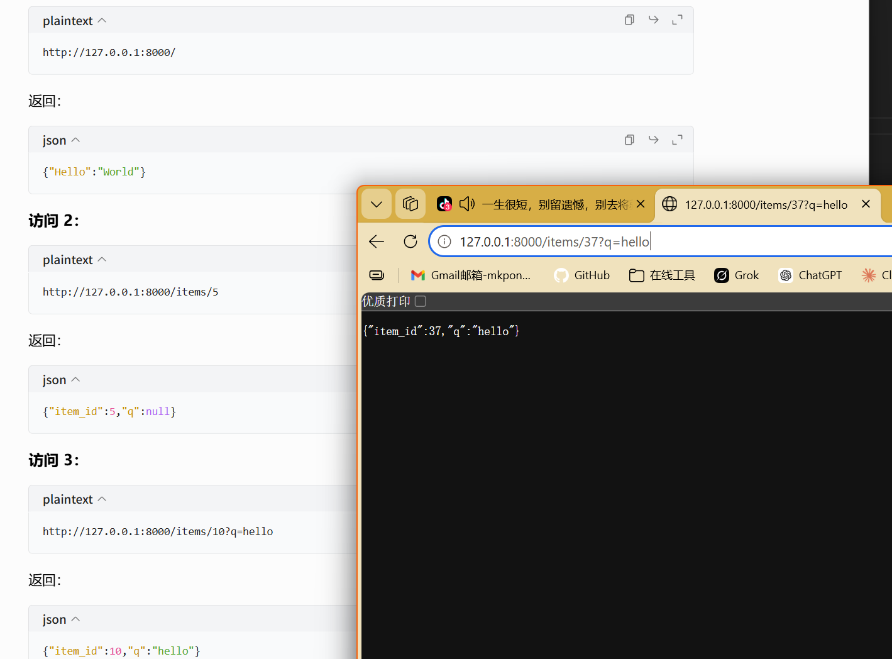

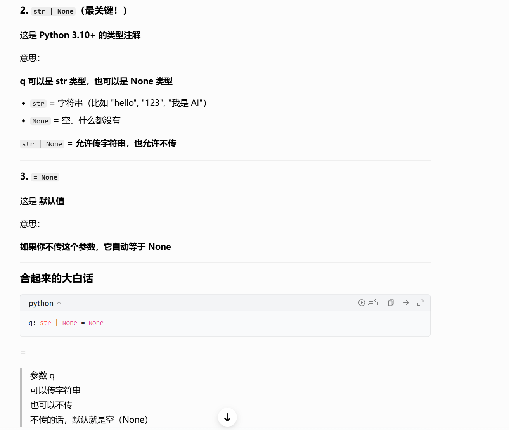

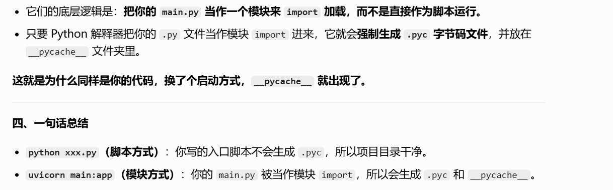

### 加async

```
async def read_root():
async def read_item(item_id: int, q: str | None = None):
```

这段代码里，加不加功能结果都一样，但是服务器并发能力不一样

因为这里没有任何要等待的操作（没有数据库、没有网络请求，没有sleep），所以async发挥不出作用

不管是不是异步，**函数名在同一个作用域里必须唯一**。

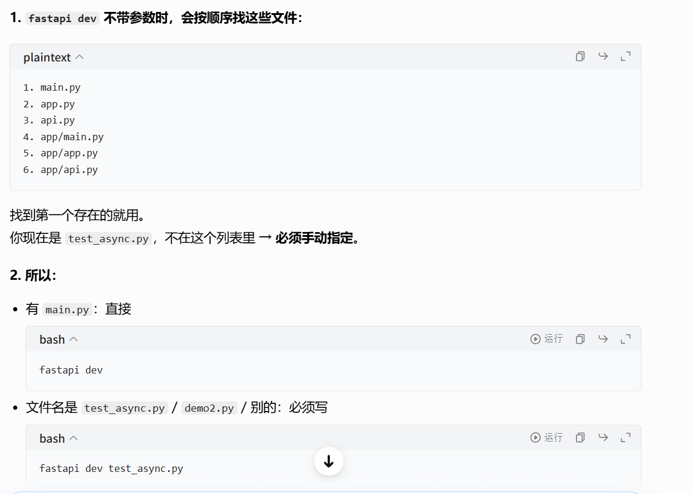

### 同步和异步

```
import time
from fastapi import FastAPI
import asyncio

app=FastAPI()

@app.get('/slow')
# 同步函数：执行完才能继续
def slow():
    time.sleep(3)# 卡住3秒
    return{"done":True}

@app.get('/fast')
# 异步函数：等待时可以让出控制权
async def fast():
    await asyncio.sleep(3)# 等待3秒，但不卡住
    return {"done":True} 
```

async def`里**绝对不能用 time.sleep**，必须用 await asyncio.sleep

```
async def：定义一个异步函数
await：    等待某个耗时操作，等待期间让出控制权
```

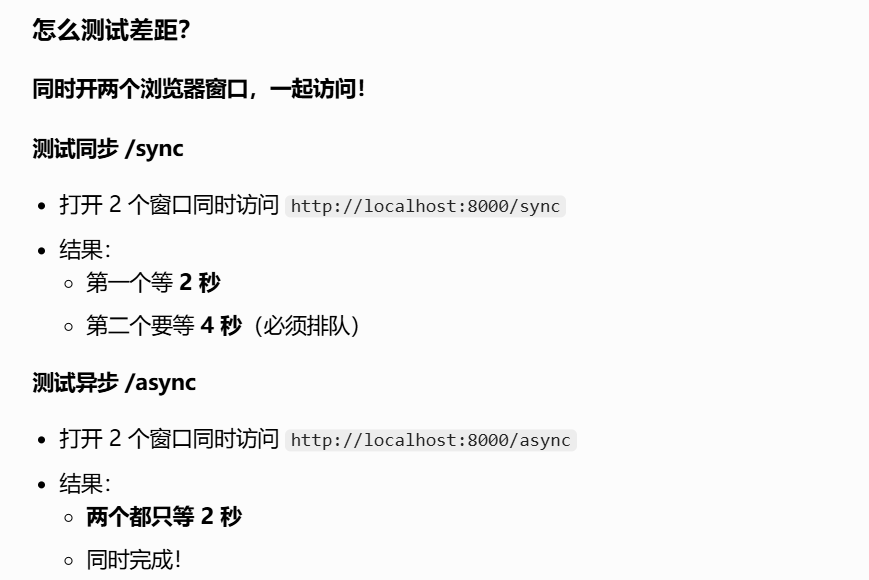

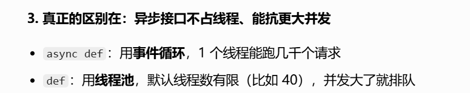

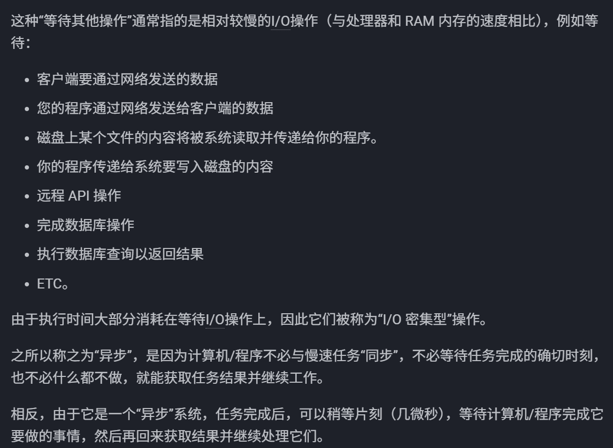

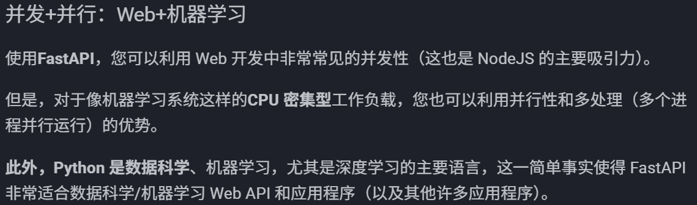

## docs

启动会自动生成交互式API文档（由 [Swagger UI](https://github.com/swagger-api/swagger-ui) 提供）：

 http://127.0.0.1:8000/docs。

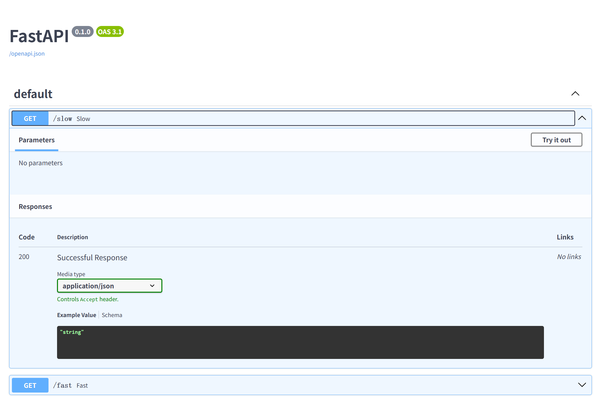

http://127.0.0.1:8000/redoc。

另一个自动生成的文档（由 [ReDoc](https://github.com/Rebilly/ReDoc) 提供）：

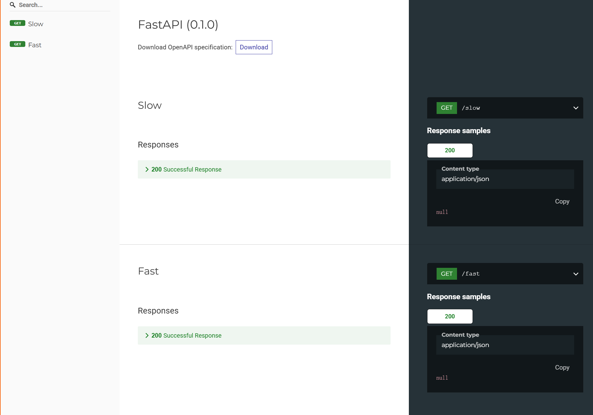

## 路由装饰器

```
from fastapi import FastAPI
app=FastAPI()

@app.get("/")
async def root():
	return {"message":"hello"}
	
@app.post("/predict")
async def predict():
	return {"result":"..."}
```

Pydantic数据校验

```
from pydantic import BaseModel
class UserInput(BaseModel):
	text:str    # 必填，字符串
	max_length: int=100 # 选填，默认100
@app.post("/analyze")
async def analyze(data:UserInput):
	# FastAPI自动校验data是否符合格式
    # 不符合直接返回400错误，不需要手写判断
	return {"input":data.text}

```

## 流式相应

```
from fastapi.responses import StreamingResponse
from fastapi import FastAPI
import asyncio
#没有 app，接口根本注册不了
app=FastAPI()

async def generate_stream():
	for word in ["hello","world","!"]:
		yield word# 每次返回一个词
		await asyncio.sleep(0.1) # 模拟延迟

#流式接口		
@app.get("/stream")
async def stream():
	return StreamingResponse(
		generate_stream(),
		media_type="text/plain"
	)
```

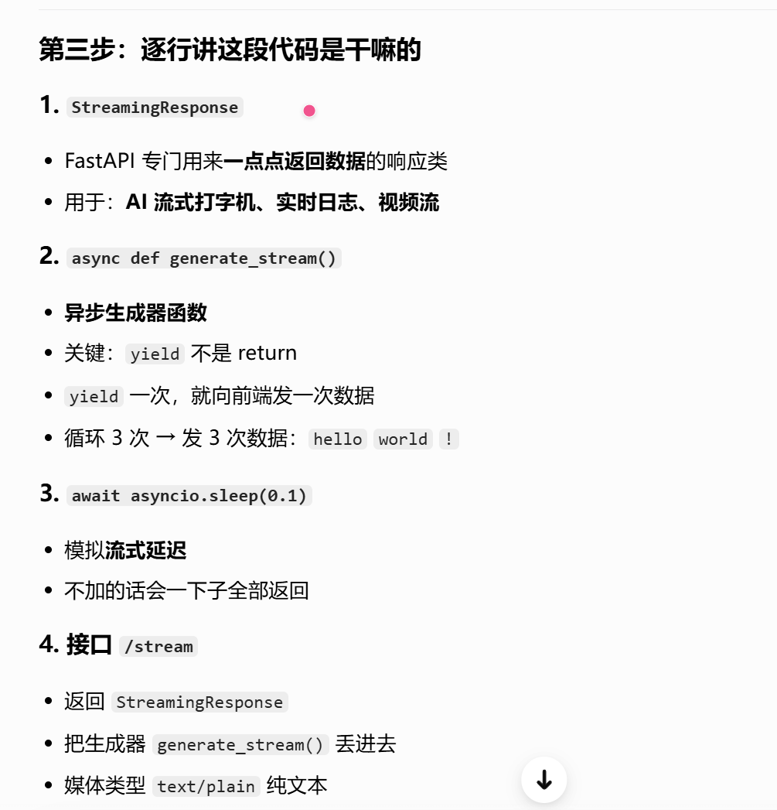

### 标准 SSE 流式格式

```
from fastapi import FastAPI
from fastapi.responses import StreamingResponse
import asyncio

app=FastAPI()

async def generate_ai_stream():
    sentences = [
        "你好！",
        "我是你的AI助手",
        "我正在以流式方式输出内容",
        "你看到的就是打字机效果",
        "这就是 SSE 标准格式"
    ]
    for word in sentences:
        # ✅ 这一行是行业标准！必须这样写！
        yield f"data: {word}\n\n"

        #模拟模型思考延迟
        await asyncio.sleep(0.5)

@app.get("/ai/stream")
async def ai_stream():
    return StreamingResponse(
        generate_ai_stream(),
        media_type="text/event-stream"
    )

```

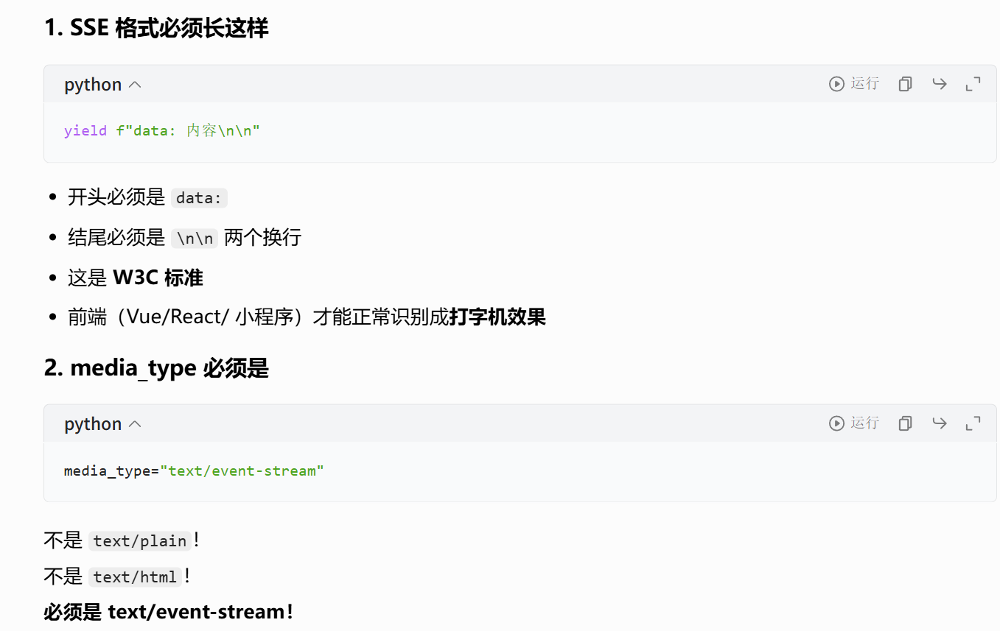

加前端

```
@app.get("/ai/stream")
async def ai_stream():
    return StreamingResponse(
        generate_ai_stream(),
        media_type="text/event-stream"
         headers={
            "Cache-Control": "no-cache",
            "Connection": "keep-alive"
        }
    )
```

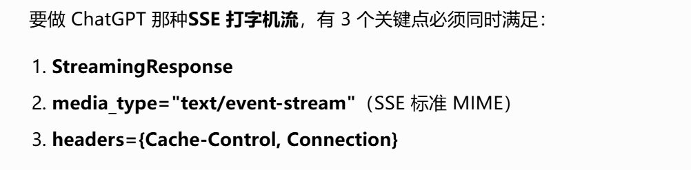


```
<!DOCTYPE html>
<html lang="zh-CN">
<head>
<meta charset="UTF-8" />
<title>SSE 打字机效果</title>
<style>
  body {
    font-family: "Microsoft YaHei", sans-serif;
    background: #f5f5f5;
    padding: 30px;
  }
  #box {
    width: 600px;
    min-height: 200px;
    background: #fff;
    padding: 20px;
    border-radius: 8px;
    box-shadow: 0 2px 8px #0002;
    white-space: pre-wrap;
    font-size: 16px;
    line-height: 1.6;
  }
  /* 闪烁光标 */
  .cursor {
    display: inline-block;
    width: 8px;
    height: 1.2em;
    background: #333;
    margin-left: 4px;
    animation: blink 0.8s step-end infinite;
    vertical-align: text-bottom;
  }
  @keyframes blink {
    0%, 100% { opacity: 1; }
    50% { opacity: 0; }
  }
  button {
    margin-bottom: 15px;
    padding: 6px 12px;
    font-size: 14px;
  }
</style>
</head>
<body>
<button id="startBtn">开始流式输出</button>
<div id="box"></div>

<script>
const startBtn = document.getElementById("startBtn");
const box = document.getElementById("box");

let source = null;
let buffer = ""; // 收到的原始文本块
let typing = false; // 是否正在逐字打字

// 逐字打字机
function typeWriter() {
  if (typing) return;
  typing = true;

  const cursor = document.createElement("span");
  cursor.className = "cursor";
  box.appendChild(cursor);

  function step() {
    if (buffer.length === 0) {
      typing = false;
      cursor.remove();
      return;
    }
    // 每次取第一个字符
    const char = buffer[0];
    buffer = buffer.slice(1);
    // 插到光标前面
    box.insertBefore(document.createTextNode(char), cursor);
    // 滚动到底
    box.scrollTop = box.scrollHeight;
    setTimeout(step, 50); // 打字速度（ms）
  }
  step();
}

// 建立 SSE 连接
function startSSE() {
  // 重置
  box.innerHTML = "";
  buffer = "";
  if (source) source.close();

  // 你的后端地址
  source = new EventSource("http://127.0.0.1:8000/ai/stream");

  source.onmessage = (e) => {
    // e.data 就是后端 yield 的那一段
    const text = e.data;
    console.log("收到：", text);
    // 加入缓冲区，让打字机慢慢“啃”
    buffer += text;
    // 启动打字机（如果没在打）
    typeWriter();
  };

  source.onerror = (err) => {
    console.error("SSE 错误：", err);
    source.close();
  };
}

startBtn.addEventListener("click", startSSE);
</script>
</body>
</html>
```

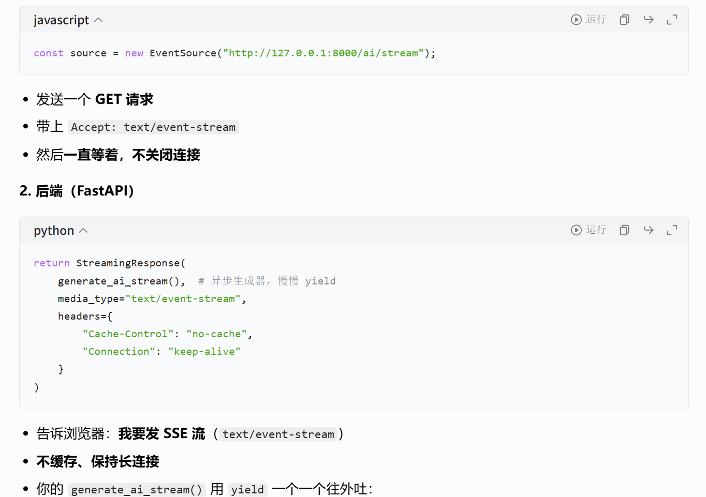

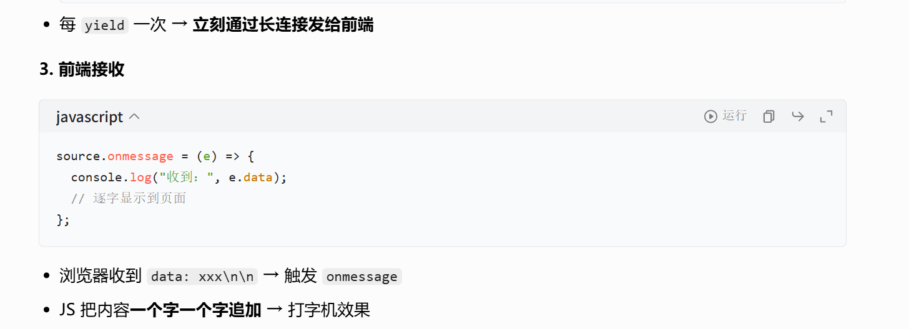

### 出现问题

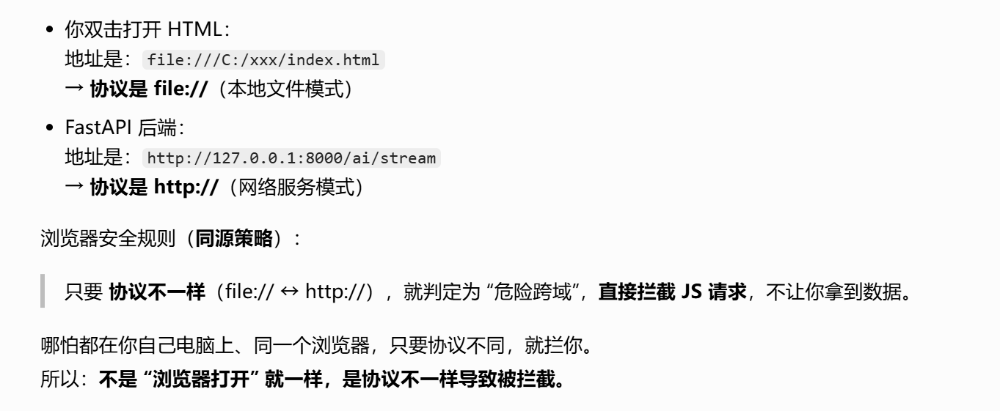


方法一


方法二：

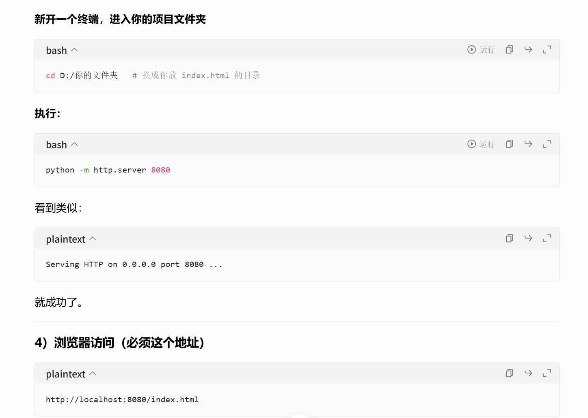

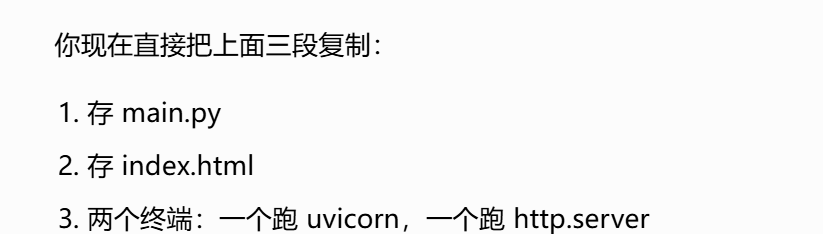

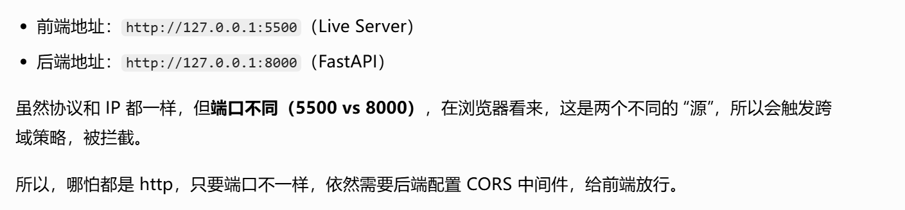

还是需要跨域中间件

```
# 2. 必须在 app 创建后、路由定义前，添加跨域中间件
app.add_middleware(
    CORSMiddleware,
    allow_origins=["*"],  # 允许所有来源（开发环境用完全没问题）
    allow_credentials=True,
    allow_methods=["*"],  # 允许所有请求方法（GET/POST 等）
    allow_headers=["*"],  # 允许所有请求头
)
```

## 跨域中间件

### 1. `CORSMiddleware`

= **跨域放行工具**

浏览器的安全规则：

**前端 5500 端口 → 后端 8000 端口，不让直接访问！**

必须加这个，才能让前端访问后端。

------

### 2. `allow_origins=["*"]`

**最关键！**

`*` = **允许所有人访问我的后端**

不管你是：

- 127.0.0.1:5500

- [localhost:8080](https://link.wtturl.cn/?target=https%3A%2F%2Flocalhost%3A8080&scene=im&aid=497858&lang=zh)

- 任何网页

	

	全都能访问你的接口。

**开发阶段必须写 ["\*"]**

------

### 3. `allow_credentials=True`

允许带**登录信息、cookie**访问。

流式接口必须开，不然会被拦截。

------

### 4. `allow_methods=["*"]`

允许所有请求方式：

- GET
- POST
- PUT
- DELETE

全开，方便你开发。

------

### 5. `allow_headers=["*"]`

允许前端带任何请求头（比如 token、json 格式）

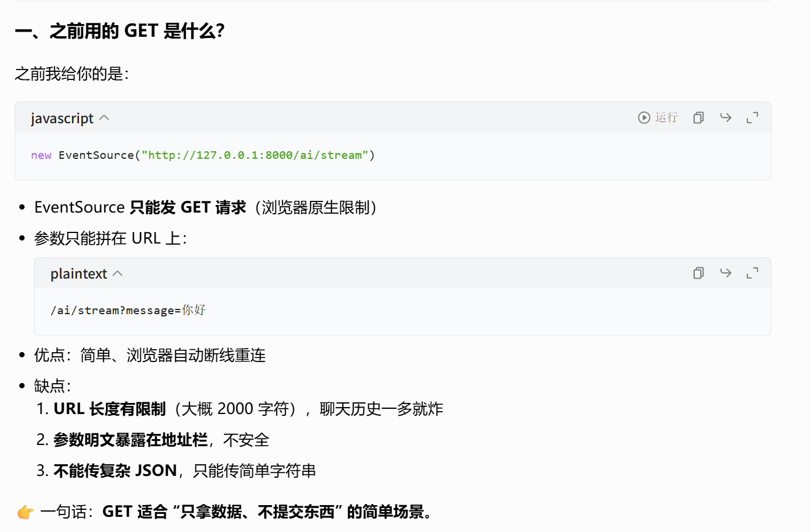

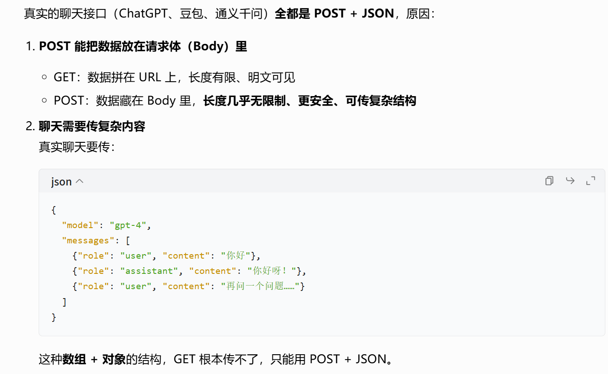


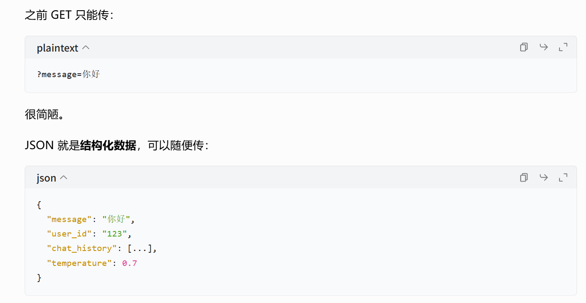

|  对比点  |     之前 GET 版     |      现在 POST + JSON 版       |
| :------: | :-----------------: | :----------------------------: |
| 请求方法 |         GET         |              POST              |
| 前端 API | EventSource（简单） | fetch + ReadableStream（灵活） |
| 参数位置 |     URL 地址栏      |          请求体 Body           |
| 数据长度 |  短（≈2000 字符）   |            几乎无限            |
|  安全性  |   低（明文可见）    |        高（藏在 Body）         |
| 复杂结构 |      ❌ 不支持       |       ✅ 支持 JSON / 数组       |
| 适用场景 |     练习、demo      |       真实聊天、生产环境       |

## 双版本

```
from fastapi import FastAPI, Request
from fastapi.responses import StreamingResponse
from fastapi.middleware.cors import CORSMiddleware
import asyncio

app = FastAPI()

# ====================
# 跨域配置（必须放最前面）
# ====================
app.add_middleware(
    CORSMiddleware,
    allow_origins=["*"],
    allow_credentials=True,
    allow_methods=["*"],
    allow_headers=["*"],
)

# ==============================
# 版本1：GET 流式接口（最简单）
# ==============================
async def generate_stream():
    sentences = [
        "你好！",
        "我是 GET 版本流式输出",
        "每个字都会慢慢出现",
        "不会连在一起",
        "这是演示版"
    ]
    for word in sentences:
        yield f"data: {word}\n\n"
        await asyncio.sleep(0.4)

@app.get("/ai/stream")
async def ai_stream():
    return StreamingResponse(
        generate_stream(),
        media_type="text/event-stream",
        headers={
            "Cache-Control": "no-cache",
            "Connection": "keep-alive"
        }
    )

# ==============================
# 版本2：POST 聊天接口（真实项目用）
# ==============================
async def generate_chat_response(user_message: str):
    responses = [
        f"你刚才说：{user_message}",
        "我是 POST 版本",
        "可以接收用户输入",
        "可以传复杂消息",
        "这是生产版接口"
    ]
    for text in responses:
        yield f"data: {text}\n\n"
        await asyncio.sleep(0.4)

@app.post("/chat/stream")
async def chat_stream(request: Request):
    body = await request.json()
    user_message = body.get("message", "")
    return StreamingResponse(
        generate_chat_response(user_message),
        media_type="text/event-stream",
        headers={
            "Cache-Control": "no-cache",
            "Connection": "keep-alive"
        }
    )
```

```
<!DOCTYPE html>
<html lang="zh-CN">
<head>
    <meta charset="UTF-8">
    <title>双版本 SSE</title>
    <style>
        #output { white-space: pre-wrap; padding:20px; background:#f5f5f5; margin-top:20px; font-size:17px; line-height:1.7 }
        button { padding:10px 20px; margin-right:10px; font-size:16px; cursor:pointer }
        input { padding:10px; width:400px; font-size:16px }
    </style>
</head>
<body>

<h2>双版本流式输出测试</h2>

<button onclick="startGET()">✅ 运行 GET 版（简单）</button>
<br><br>

<input type="text" id="msg" placeholder="输入消息">
<button onclick="startPOST()">✅ 运行 POST 版（真实聊天）</button>

<div id="output"></div>

<script>
const output = document.getElementById("output");

// ------------------------------
// 版本1：GET（最简单）
// ------------------------------
function startGET() {
    output.innerText = "";
    const source = new EventSource("http://127.0.0.1:8000/ai/stream");
    source.onmessage = e => {
        output.innerText += e.data + "\n";
    };
}

// ------------------------------
// 版本2：POST（真实项目）
// ------------------------------
async function startPOST() {
    const message = document.getElementById("msg").value;
    output.innerText = "";

    const res = await fetch("http://127.0.0.1:8000/chat/stream", {
        method: "POST",
        headers: { "Content-Type": "application/json" },
        body: JSON.stringify({ message })
    });

    const reader = res.body.getReader();
    const decoder = new TextDecoder();
    let buf = "";

    while (1) {
        const { done, value } = await reader.read();
        if (done) break;
        buf += decoder.decode(value);
        const lines = buf.split("\n\n");
        buf = lines.pop();
        for (let line of lines) {
            if (line.startsWith("data: ")) {
                output.innerText += line.slice(6) + "\n";
            }
        }
    }
}
</script>

</body>
</html>
```

发现js有些遗忘，后面需要再学一下，再回头处理这部分

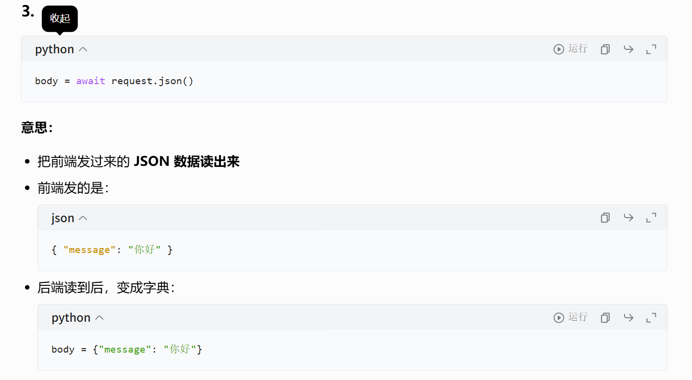

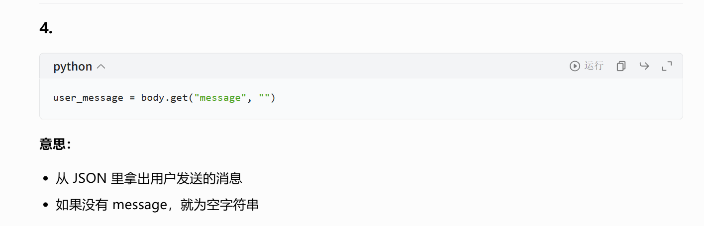

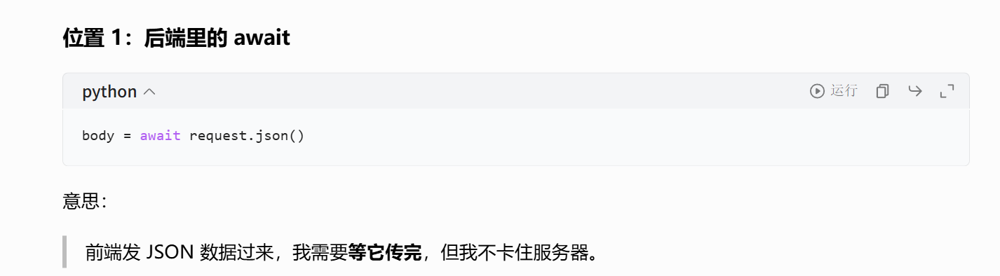

 **await 必须写在【需要等待、而且是异步操作】的那一行前面！**

**只有 “需要等” 的操作，才配写 await！**

`request.json()` 是一个 “需要等待” 的操作！

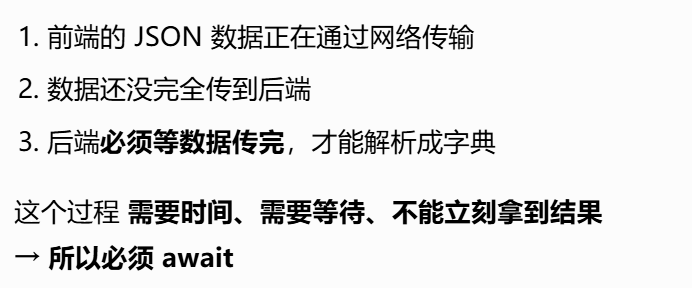

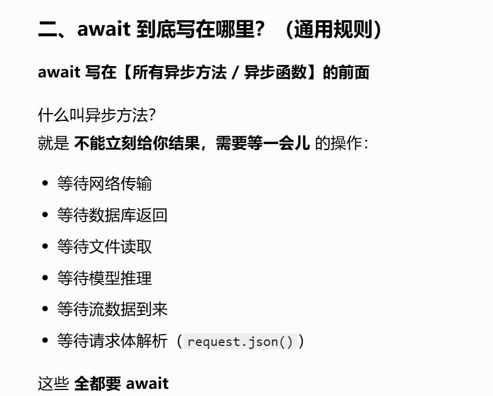

## 问答

**问：FastAPI 和 Flask 最大区别？**

> FastAPI 原生支持异步，基于 Pydantic 自动数据校验，自动生成 API 文档。AI 项目模型推理耗时长，异步能大幅提升并发性能，所以现在 AI 项目更多用 FastAPI。

**问：什么是异步？为什么 AI 项目需要异步？**

> 异步允许程序在等待 IO 操作（网络请求、模型推理）时不阻塞，继续处理其他请求。AI 模型推理通常需要几秒，同步框架会让所有请求排队，异步可以并发处理多个请求，吞吐量提升明显。

**问：Pydantic 是什么？**

> Python 的数据校验库，用类型注解定义数据结构，自动校验输入数据格式，不合法直接返回错误，不需要手写 if 判断。FastAPI 深度集成 Pydantic。

**第一个：await 的作用**

await 告诉程序：这里有个耗时操作，等待的时候你去处理别的请求，等它完成了再回来继续。

**第二个：为什么AI项目需要异步**

> 模型推理需要3-5秒，同步框架处理第一个请求时，第二个用户只能干等。异步框架推理等待期间可以去处理第二、三个请求，10个用户并发请求时响应时间从50秒变成5秒。

## 小应用

```
from fastapi import FastAPI
from pydantic import BaseModel
from openai import OpenAI
import uvicorn

app = FastAPI(title="AI对话接口", description="基于DeepSeek的对话API")

# 初始化客户端
client = OpenAI(
    api_key="sk-pdoegctjndihnwvleajxkydpzzvhjeuagtaheyzerygxhusn",
    base_url="https://api.siliconflow.cn/v1"
)

# ===== 数据模型 =====
class ChatRequest(BaseModel):
    message: str
    system_prompt: str = "You are a helpful assistant"  # 有默认值，可不传

class ChatResponse(BaseModel):
    reply: str
    tokens_used: int

# ===== 接口 =====
@app.get("/")
async def root():
    return {"status": "运行中", "message": "AI对话接口已启动"}

@app.post("/chat", response_model=ChatResponse)
async def chat(request: ChatRequest):
    """普通对话接口"""
    response = client.chat.completions.create(
        model="Pro/deepseek-ai/DeepSeek-V3.2",
        messages=[
            {"role": "system", "content": request.system_prompt},
            {"role": "user", "content": request.message}
        ]
    )
    return ChatResponse(
        reply=response.choices[0].message.content,
        tokens_used=response.usage.total_tokens
    )

@app.get("/health")
async def health():
    """健康检查接口"""
    return {"status": "ok"}

if __name__ == "__main__":
    uvicorn.run(app, host="0.0.0.0", port=8000)
```

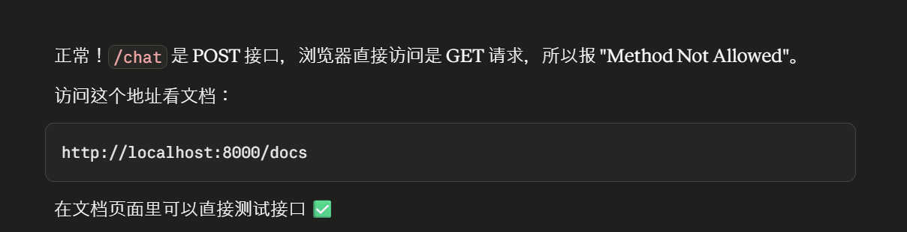

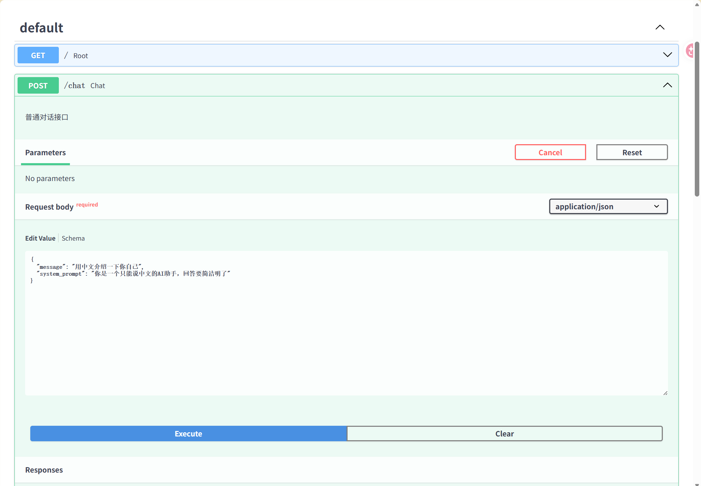

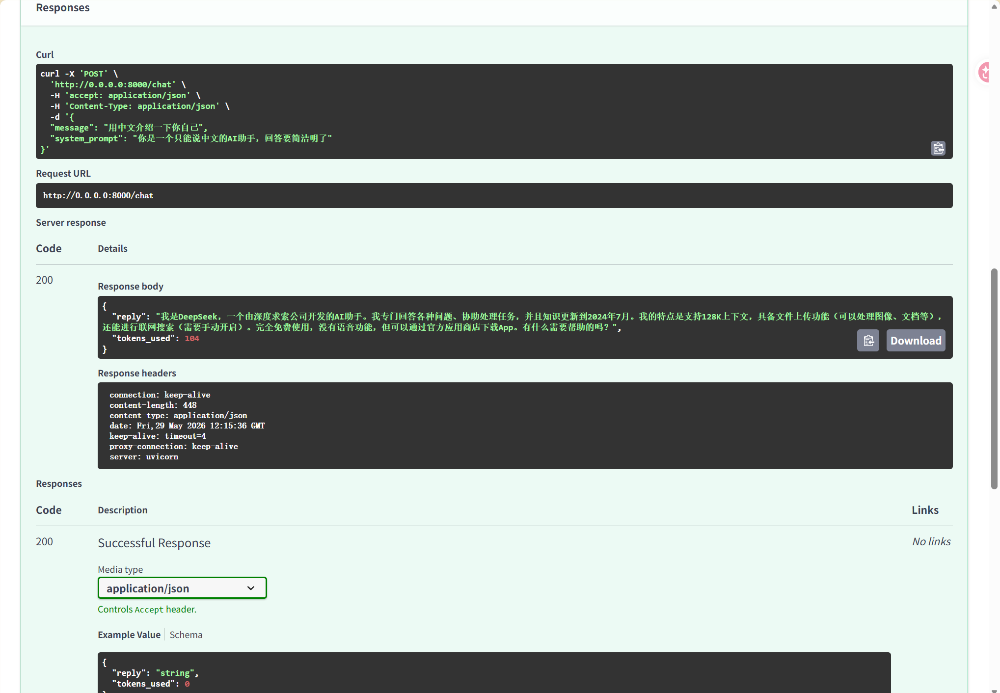

```
curl -X 'POST' \
  'http://0.0.0.0:8000/chat' \
  -H 'accept: application/json' \
  -H 'Content-Type: application/json' \
  -d '{
  "message": "用中文介绍一下你自己",
  "system_prompt": "你是一个只能说中文的AI助手，回答要简洁明了"
}'
```

实际输入到终端是这样的

```
curl.exe --% -X POST -H "accept: application/json" -H "Content-Type: application/json" -d "{\"message\":\"用中文介绍一下你自己\",\"system_prompt\":\"你是一个只能说中文的AI助手，回答要简洁明了\"}" http://127.0.0.1:8000/chat
```

**PowerShell 不支持 `\` 换行**

**不支持 `^` 换行**

**FastAPI 自动生成的 curl 命令只给 Linux/Mac 用，Windows 用不了**

**你把多行命令拆行了，系统以为你在输好几个命令**


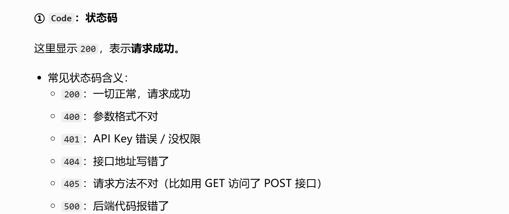

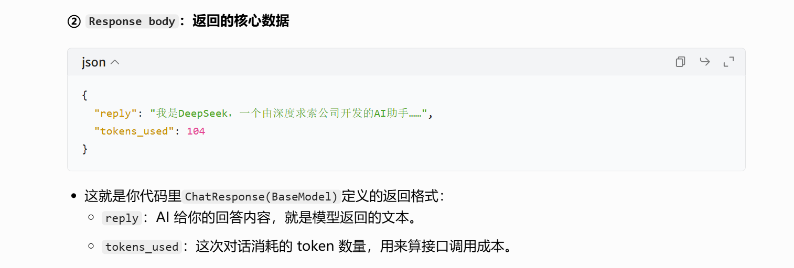

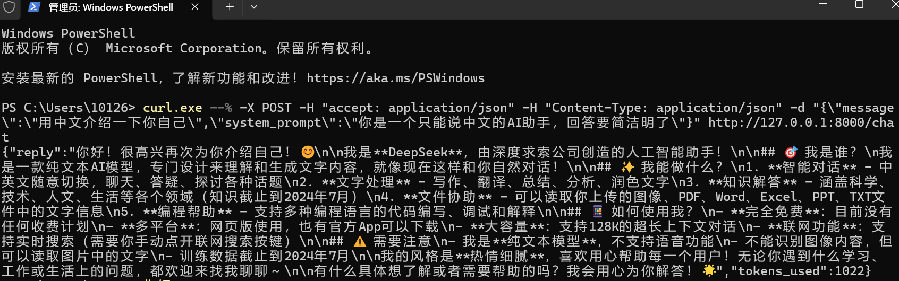

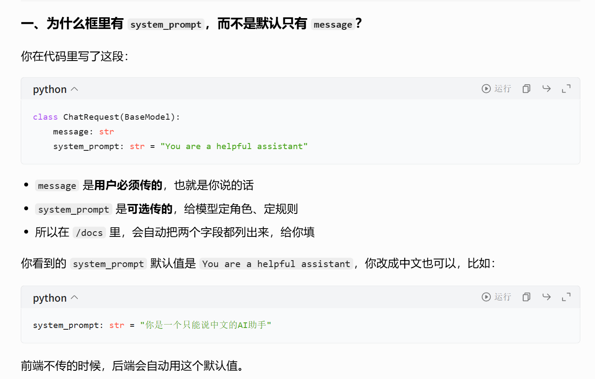

名字自己起，前后端相同即可

## 自动文档

修改main.py文件接受来自PUT请求的请求体

`fastapi dev` 服务器会自动重载。

```
from fastapi import FastAPI
from pydantic import BaseModel

app=FastAPI()

class Item(BaseModel):
    name: str
    price: float
    is_offer:bool | None =None

@app.get("/")
def read_root():
    return {"hello":"world"}

@app.get("/items/{item_id}")
def read_item(item_id:int,q:str | None=None):
    return {"item_id":item_id,"q":q}

@app.put("/items/{item_id}")
def update_item(item_id:int,item:Item):
    return {"item_name":item.name,"item_id":item_id}
```

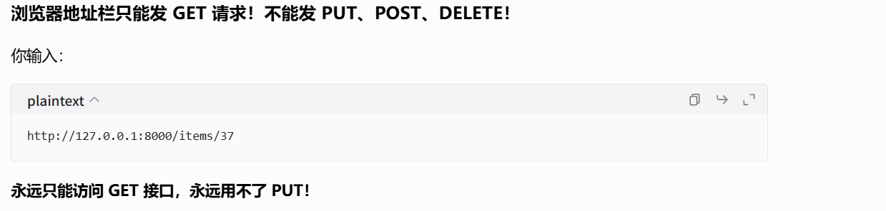

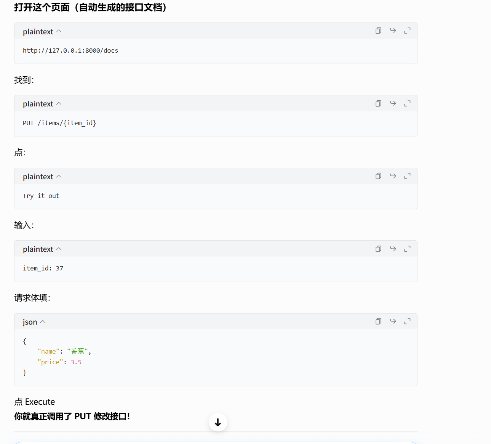

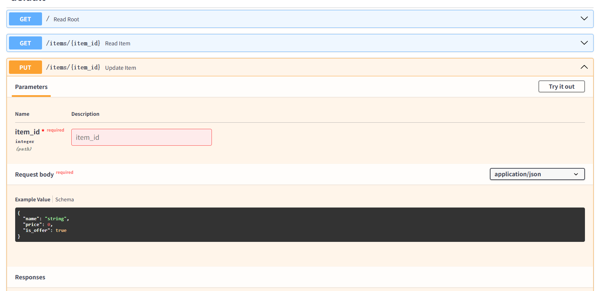

点击try it out，编辑完后点击execute

JSON：**键和字符串必须双引号**，单引号直接报错

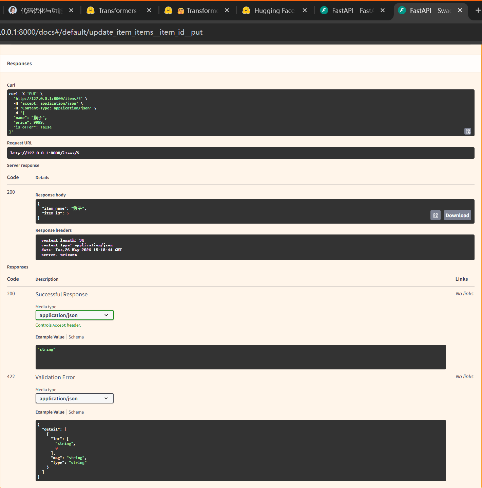

你用 PUT 发数据给 `/items/5` → 服务器收到数据，立刻返回给你

但数据**没有被保存**在任何地方（没有数据库，也没有内存变量）

✅ **PUT 请求本身是成功的**，数据也被服务器正确解析了。

❌ **数据没有被保存**，所以 GET 访问 `/items/5` 不会看到修改后的结果。

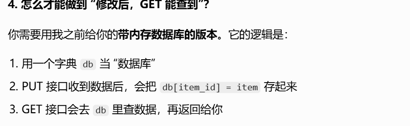

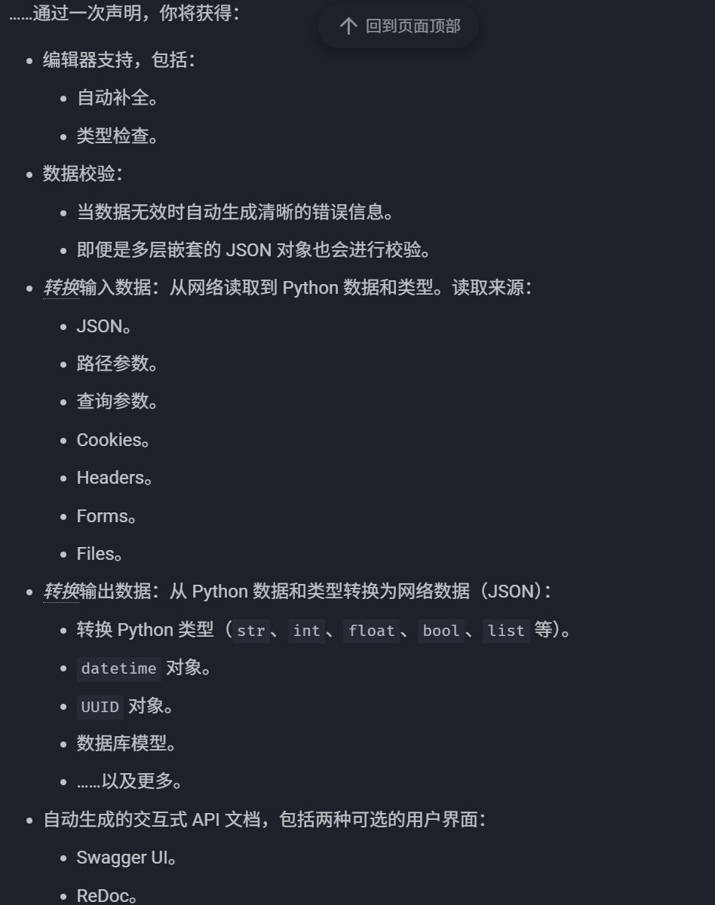

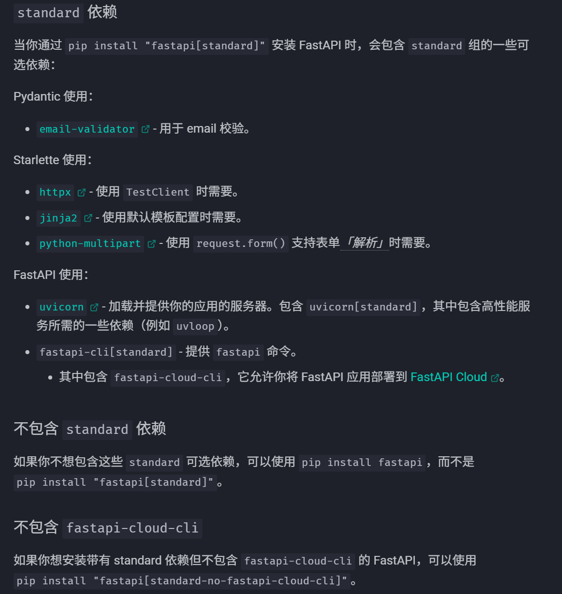

```
from datetime import date
from pydantic import BaseModel

#将变量声明为str、
#并在函数内获得编辑器支持
def mian(user_id:str):
	return user_id
	
class User(BaseModel):
	id:int
	name:str
	joined:date
```

可以这样来使用

```
my_user: User = User(id=3, name="John Doe", joined="2018-07-19")
second_user_data={
    "id": 4,
    "name": "Mary",
    "joined": "2018-11-30",
}
my_second_user:User=User(**second_user_data)
print(my_user)
print(my_second_user.name)
```

`*second_user_data` 意思是：

直接将 `second_user_data` 字典的键和值作为 key-value 参数传入，等同于：`User(id=4, name="Mary", joined="2018-11-30")`

`joined="2018-07-19"`：**字符串自动转成 date 对象**

类型不对会直接抛 `ValidationError`（比如 `joined=123`）

## Starlette 特性[¶](https://fastapi.tiangolo.com/zh/features/#starlette-features)

**FastAPI** 和 [**Starlette**](https://www.starlette.dev/) 完全兼容（并基于）。所以，你有的其他的 Starlette 代码也能正常工作。`FastAPI` 实际上是 `Starlette` 的一个子类。所以，如果你已经知道或者使用 Starlette，大部分的功能会以相同的方式工作。

通过 **FastAPI** 你可以获得所有 **Starlette** 的特性（FastAPI 就像加强版的 Starlette）：

- 令人惊叹的性能。它是[Python 可用的最快的框架之一，和 **NodeJS** 及 **Go** 相当](https://github.com/encode/starlette#performance)。
- **支持 WebSocket**。
- 进程内后台任务。
- Startup 和 shutdown 事件。
- 测试客户端基于 HTTPX。
- **CORS**、GZip、静态文件、流响应。
- 支持 **Session 和 Cookie**。
- 100% 测试覆盖率。
- 代码库 100% 类型注释。

## 环境变量

你可以在**shell（终端）中****创建**和使用环境变量，而无需使用 Python：

```
创建环境变量MY_NAME
$Env:MY_NAME="caixukun"
可以与其他程序一起使用，如
$echo "hellow $ENV:MY_NAME"
```

```
import os
name=os.getenv("MY_NAME","World")
print(f"Hello {name} from Python")
```

如果未提供，则`None`使用默认值，这里我们提供的`"World"`默认值即为默认值。

```BASH
💬 Here we don't set the env var yet
Python main.py

💬 As we didn't set the env var, we get the default value

Hello World from Python

💬 But if we create an environment variable first
$Env:MY_NAME = "韦德·威尔逊"

💬 And then call the program again
python main.py

💬 Now it can read the environment variable

Hello Wade Wilson from Python
```

​	假设你安装了 Python，它最终位于一个目录中`C:\opt\custompython\bin`。

如果您选择更新`PATH`环境变量，安装程序将向环境变量`C:\opt\custompython\bin`中添加相应内容`PATH`。

```
C:\Program Files\Python312\Scripts;C:\Program Files\Python312;C:\Windows\System32;C:\opt\custompython\bin
```

这样，当你`python`在终端中输入命令时，系统就会在`C:\opt\custompython\bin`（最后一个目录）中找到 Python 程序并使用它。

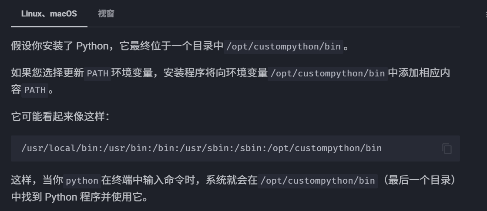

## 虚拟环境

```
cd
mkdir code
cd code
mkdir awesome-project
cd awesome-project
```

创建虚拟环境

python -m venv .venv

该命令会在名为 . 的目录中创建一个新的虚拟环境`.venv`。

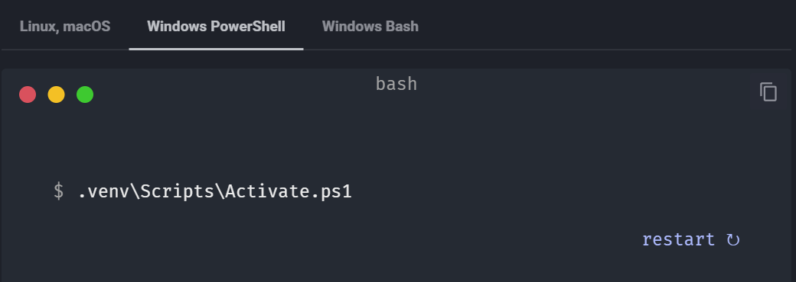

每次在该环境中安装**新软件包**时，都要重新**激活**该环境。

这样可以确保，如果您使用该软件包安装的**终端（CLI）程序**，则使用的是虚拟环境中的程序，而不是全局安装的任何其他程序，这些程序的版本可能与您需要的版本不同。

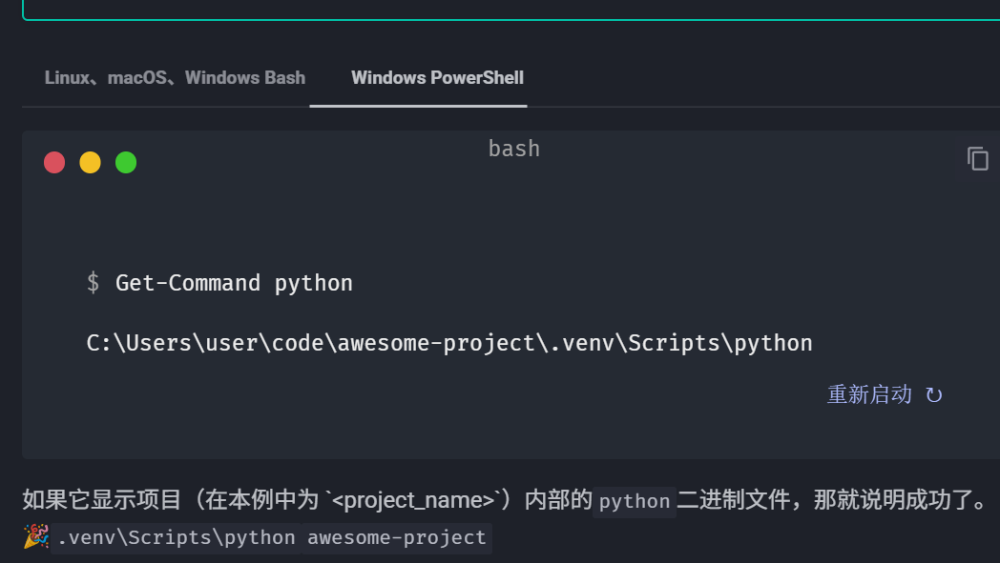

确保虚拟环境已激活（使用上述命令），然后运行：

python -m pip install --upgrade pip

### 添加.gitignore

将目录中的所有内容排除.venv在Git之外

echo  "*" >  .venv/.gitignore        文件夹1 / 文件夹2 / 文件

对于`*`Git 来说，这意味着“一切”。因此，它会忽略`.venv`目录中的所有内容。

### 安装依赖

pip install "fastapi[standard]"

pip install -r requirements.txt

### 停用

$ deactivate

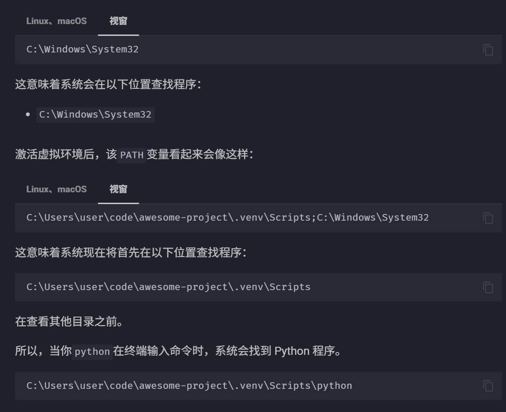

```
cd ~/code/prisoner-of-azkaban
您无需在旧目录中即可停用，您可以在任何地方进行停用，即使切换到其他项目后也可
deactivate
在 prisoner-of-azkaban/.venv 中激活虚拟环境 
source .venv/bin/activate
python main.py
```

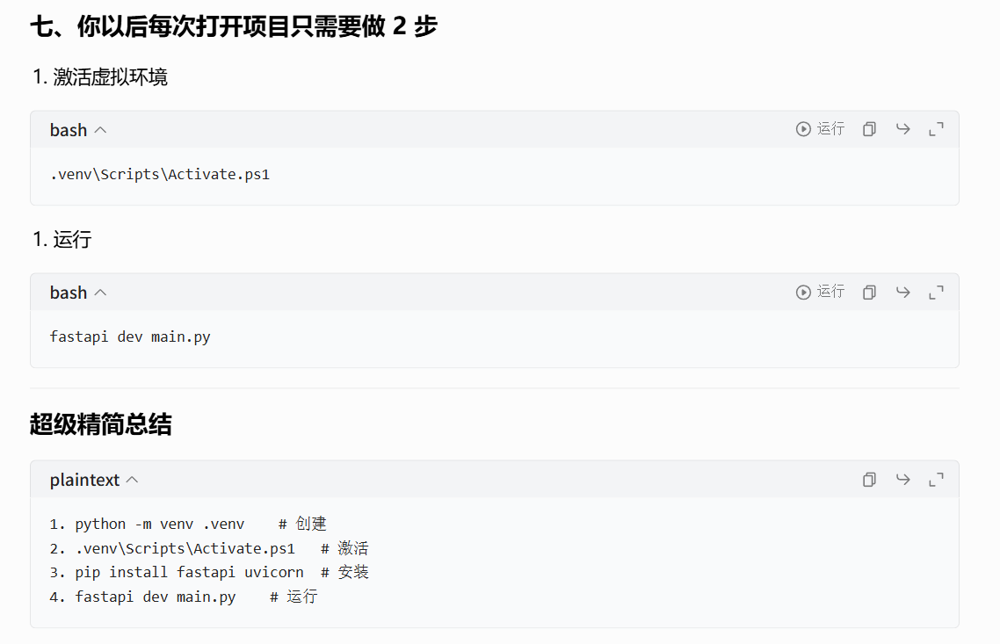


```
from enum import Enum

from fastapi import FastAPI


class ModelName(str, Enum):
    alexnet = "alexnet"
    resnet = "resnet"
    lenet = "lenet"


app = FastAPI()


@app.get("/models/{model_name}")
async def get_model(model_name: ModelName):
    if model_name is ModelName.alexnet:
        return {"model_name": model_name, "message": "Deep Learning FTW!"}

    if model_name.value == "lenet":
        return {"model_name": model_name, "message": "LeCNN all the images"}

    return {"model_name": model_name, "message": "Have some residuals"}
```

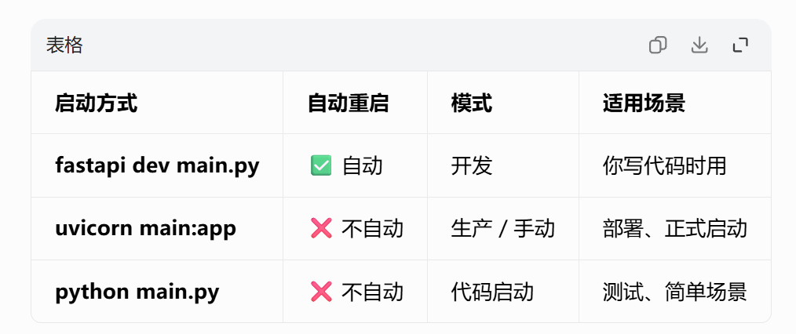

