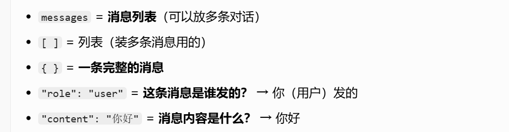
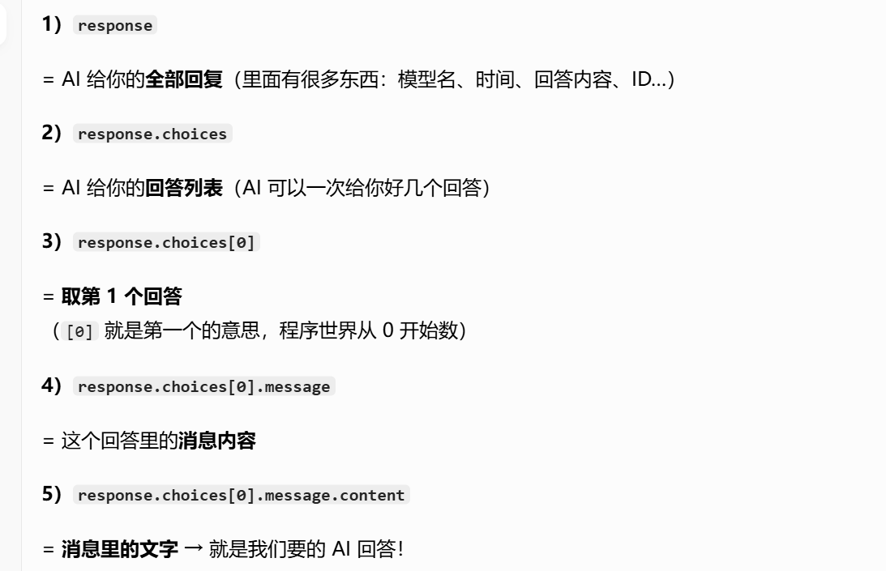
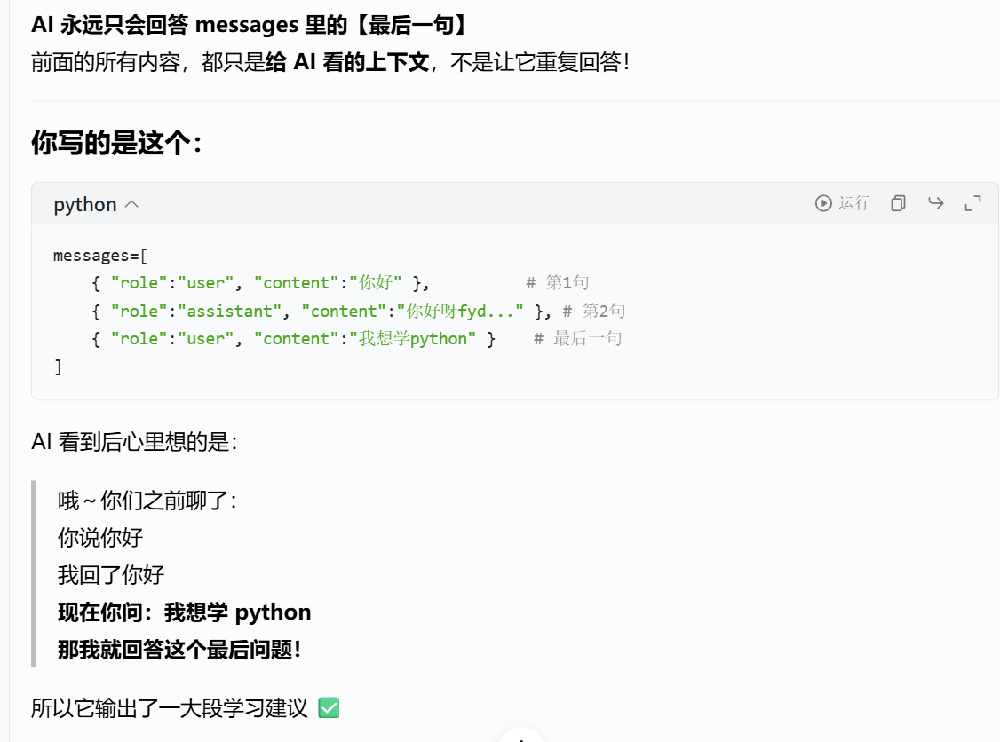
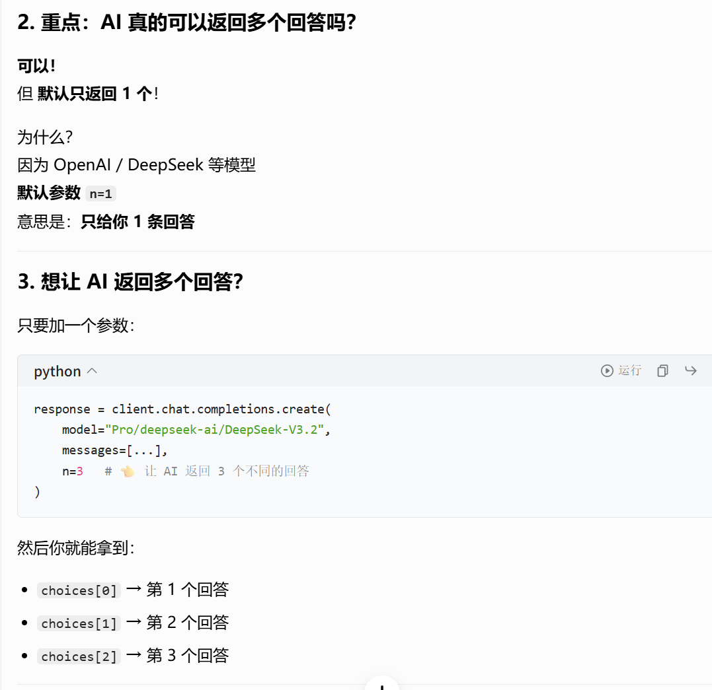
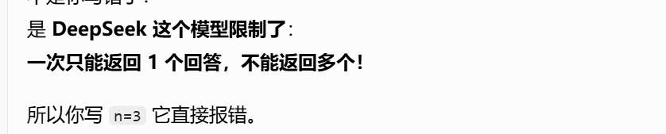
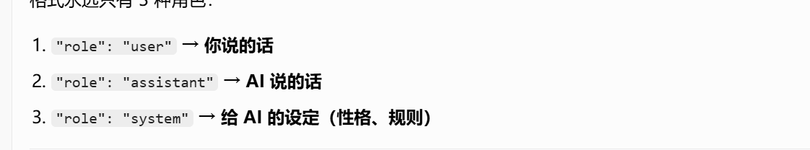
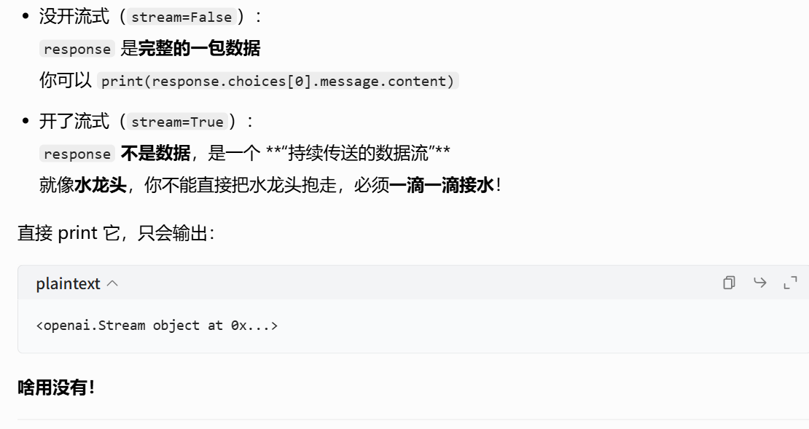
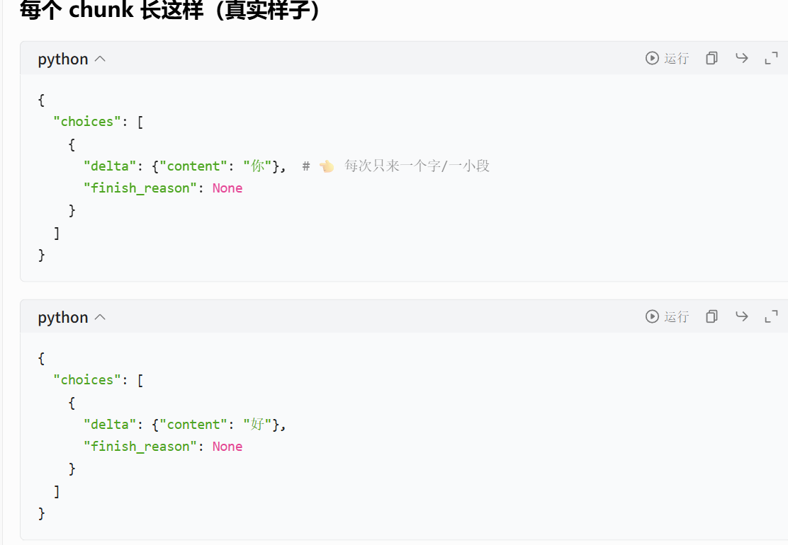

## 安装

pip install openai

## 测试api请求

国内不能这样写

```
from openai import OpenAI
client = OpenAI()

stream = client.responses.create(
    model="gpt-5.5",
    input=[
        {
            "role": "user",
            "content": "Say 'double bubble bath' ten times fast.",
        },
    ],
    stream=True,
)

for event in stream:
    print(event)
```

正确写法

```
from openai import OpenAI
client=OpenAI(
    api_key="sk-pdoegctjndihnwvleajxkydpzzvhjeuagtaheyzerygxhusn",
    base_url="https://api.siliconflow.cn/v1"
)

response=client.chat.completions.create(
    model="Pro/deepseek-ai/DeepSeek-V3.2",
    messages=[{
        "role":"user","content":"你好"
    }]
)
print(response.choices[0].message.content)
```





```
messages=[{
        "role":"user","content":"你好",
    },
    {
        "role":"assistant","content":"你好呀fyd,有什么我能帮你的吗"
    },
    {
        "role":"user","content":"我想学python"
    }
    ]
```

他只会回答最后一句



如果只是response

```
ChatCompletion(id='019e5f83907d84740f89a7300e269221', choices=[Choice(finish_reason='stop', index=0, logprobs=None, message=ChatCompletionMessage(content='你好！😊 很高兴见到你！我是DeepSeek，由深度求索公司创造的AI助手。无论你有什么问题、需要什么帮助，或者只是想聊聊天，我都很乐意为你提供帮助！\n\n有什么我可以为你做的吗？比如回答问题、协助解决问题、进行创作讨论，或者别的什么？我会尽我所能热情地帮助你！✨', refusal=None, role='assistant', annotations=None, audio=None, function_call=None, tool_calls=None))], created=1779718918, model='Pro/deepseek-ai/DeepSeek-V3.2', object='chat.completion', service_tier=None, system_fingerprint='', usage=CompletionUsage(completion_tokens=72, prompt_tokens=5, total_tokens=77, completion_tokens_details=CompletionTokensDetails(accepted_prediction_tokens=None, audio_tokens=None, reasoning_tokens=0, rejected_prediction_tokens=None), prompt_tokens_details=PromptTokensDetails(audio_tokens=None, cached_tokens=0), prompt_cache_hit_tokens=0, prompt_cache_miss_tokens=5))
```

如果只是response.choices

```
[Choice(finish_reason='stop', index=0, logprobs=None, message=ChatCompletionMessage(content='你好！很高兴见到你！😊 我是DeepSeek，由深度求索公司创造的AI助手。我很乐意为你提供帮助！\n\n无论你有什么问题、需要什么协助，或者只是想聊聊天，我都很愿意和你交流。我可以帮你解答问题、处理文本、分析文档、进行创意思考等等。\n\n今天有什么我可以为你做的吗？请随时告诉我你的需求！✨', refusal=None, role='assistant', annotations=None, audio=None, function_call=None, tool_calls=None))]
```

response.choices[0]

```
Choice(finish_reason='stop', index=0, logprobs=None, message=ChatCompletionMessage(content='你好！很高兴见到你！😊 我是DeepSeek，由深度求索 公司创造的AI助手。我在这里随时准备为你提供帮助，无论是回答问题、协助思考问题，还是进行有趣的对话。\n\n有什么我可以帮助你的吗？不管是学习、工作还是生活中的问题，我都很乐意和你一起探讨！✨', refusal=None, role='assistant', annotations=None, audio=None, function_call=None, tool_calls=None))
```

response.choices[0].message

```
ChatCompletionMessage(content='你好！很高兴见到你！😊\n\n我是DeepSeek ，由深度求索公司创造的AI助手。今天有什么可以帮助你的吗？无论是回答问题、协助思考问题、写作、学习讨论，还是其他任何需要，我都很乐意为你提供帮助！\n\n请随时告诉我你想了解什么或需要什么协助～', refusal=None, role='assistant', annotations=None, audio=None, function_call=None, tool_calls=None)
```





```
messages=[{
        "role":"system","content":"你是一个非常温柔的编程老师，说话要简单易懂，不要用专业术语",
    },
    {
        "role":"user","content":"老师,写代码好累啊,要学好多东西啊",
    }
    ],
```



```
for chunk in response:
	#.delta.content = 这一小段里的文字内容
    text = chunk.choices[0].delta.content
    if text is not None:
        print(text, end="", flush=True)# 立刻打印
print() 
```






实现了多轮对话上下文记忆

```
from openai import OpenAI
client=OpenAI(
    api_key="sk-pdoegctjndihnwvleajxkydpzzvhjeuagtaheyzerygxhusn",
    base_url="https://api.siliconflow.cn/v1"
)
messages=[
    {"role":"system","content":"你是一个温柔的编程老师"}
]

while True:
    user_input=input("你：")
    messages.append({"role":"user","content":user_input})

    response=client.chat.completions.create(
        model="Pro/deepseek-ai/DeepSeek-V3.2",
        messages=messages,
        stream=True,
    )
    reply=""
    for chunk in response:
        if not chunk.choices:
            continue
        text=chunk.choices[0].delta.content
        if text is not None:
            print(text,end="",flush=True)
            reply+=text
    print()
```

```
hon/Python312/python.exe d:/projects/openai学习/example3.py
你：老师，学编程心好累，现在几点了
我理解你现在的心情。不过现在几点我无法知道准确时间，建议你看看桌上的时钟或电脑右下角的时间显示。

当学习编程感到累的时候，可以试着：
1. 休息10分钟，喝杯水
2. 把大问题分解成小步骤
3. 回顾你已学到的知识

每个程序员都有这样的时刻，你并不孤单。需要我帮你看看代码哪里卡住了吗？

你：125*125等于
让我为你分解一下计算过程：

**方法一：直接计算**
125 × 125 = 15625

**方法二：分解计算**
可以看作 (100 + 25) × 125 = 100×125 + 25×125  
= 12500 + 3125 = 15625

✨ 记住：学习编程就像做数学题一样，有时候换个思路，问题就会变得简单。 你学得很认真，累了就休息一下哦~
你：那再乘125呢，就乘出来就行              
好的，我们一步步来计算：  

已知 125 × 125 = 15625（之前的结果）。  
现在要再乘 125，也就是：  

**15625 × 125**  

1. 先算 15625 × 100 = 1562500  
2. 再算 15625 × 25 = 15625 × 100/4 = 1562500/4 = 390625  
3. 最后相加：  
   1562500 + 390625 = **1953125**  

所以答案是 **1953125**。  

**提示：** 其实这里的规律是  
125³ = (5³)³ = 5⁹ = 1953125，算得很快。
```

ai改进代码：

```
from openai import OpenAI
import time

# ============== 配置 ==============
client = OpenAI(
    api_key="sk-pdoegctjndihnwvleajxkydpzzvhjeuagtaheyzerygxhusn",
    base_url="https://api.siliconflow.cn/v1"
)

SYSTEM_PROMPT = "你是一个温柔的编程老师，耐心、简洁、易懂"
messages = [{"role": "system", "content": SYSTEM_PROMPT}]

# ============== 主程序 ==============
print("🔥 AI聊天机器人（流式输出+上下文记忆）")
print("输入 退出/exit 结束 | 输入 清空 重置对话\n")

while True:
    user_input = input("你：").strip()
    
    # 指令判断
    if not user_input:
        print("请输入内容！")
        continue
    if user_input.lower() in ["exit", "quit", "退出"]:
        print("👋 对话结束！")
        break
    if user_input == "清空":
        messages = [{"role": "system", "content": SYSTEM_PROMPT}]
        print("✅ 已重置上下文！\n")
        continue

    # 加入用户消息
    messages.append({"role": "user", "content": user_input})

    # AI回复（流式 + 异常处理）
    print("AI：", end="", flush=True)
    reply = ""
    try:
        response = client.chat.completions.create(
            model="Pro/deepseek-ai/DeepSeek-V3.2",
            messages=messages,
            stream=True,
            temperature=0.7,
            max_tokens=2000
        )

        for chunk in response:
            if not chunk.choices:
                continue
            text = chunk.choices[0].delta.content
            if text:
                print(text, end="", flush=True)
                reply += text
                time.sleep(0.01)  # 打字机效果

        # 保存AI回复到上下文
        messages.append({"role": "assistant", "content": reply})
        print("\n")

    except Exception as e:
        print(f"\n❌ 出错：{str(e)}\n")
        messages.pop()  # 出错了撤回用户输入
```

