## 简介

Gradio 是一个开源 Python 库，能把任意 Python 函数 / ML 模型，用几行代码变成可分享的 Web 交互界面，不用写前端。

## 投放公网

**gradio 里 share=True 生成的公网链接：不是永久，是 72 小时有效**，而且必须**你的电脑一直开机、程序一直运行**，别人才能访问。

**Hugging Face Spaces 可以免费、永久托管 Gradio 应用**，部署后会给你一个**永久公网 URL**，别人随时能访问，不用你电脑开机。

**托管后的应用默认是公开（Public）**，全世界都能通过那个公网链接在线用；也可以设为私有。

## 安装

pip install --upgrade gradio


## 第一个gradio应用

```
import gradio as gr
def greet(name,intensity):
    return "hello, "+ name + "|" * int(intensity)

demo=gr.Interface(
    fn=greet,
    inputs=["text","slider"],
    outputs=["text"],
    api_name="predict"
)

demo.launch()
#demo.launch(share=True)需要魔法，可以使在公网访问
```

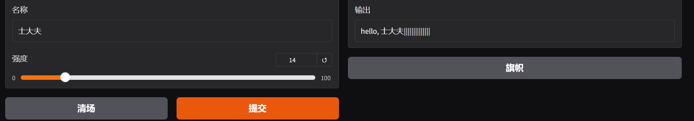

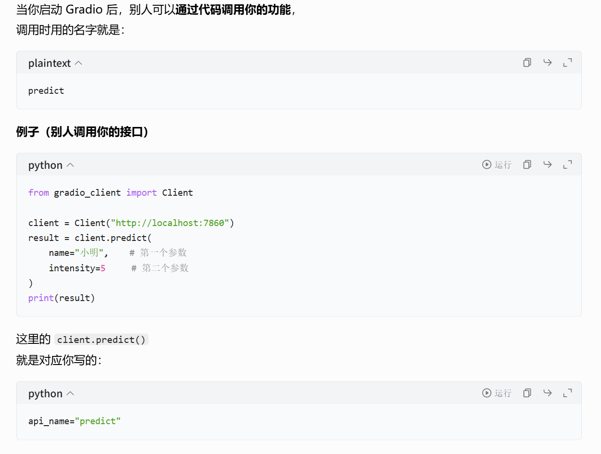

## gradio输入组件

### 文本类

```
"text"             # 普通文本输入
gr.Textbox()        # 同上，更强大
gr.Number()         # 只允许输入数字
```

### 选择类

```
gr.Slider()         # 滑动条（你已经用了）
gr.Dropdown()       # 下拉选择
gr.Radio()          # 单选按钮
gr.Checkbox()       # 勾选框
gr.CheckboxGroup()  # 多选框
```

### 媒体上传

```
gr.Image()          # 上传图片
gr.Audio()          # 上传/录音
gr.Video()          # 上传视频
gr.File()           # 上传任意文件
```

### 布局 / 交互

```
gr.ColorPicker()    # 取色器
gr.DatePicker()     # 日期选择
gr.Label()          # 标签
gr.HTML()           # 自定义HTML
```

### 聊天专用

```
gr.Chatbot()        # 聊天界面
gr.MultimodalTextbox # 多模态输入（文字+图片）
```

```
import gradio as gr
def demo_fn(name,age,like_ai,city,pic):
	return f"""
	你叫：{name}
	年龄：{age}
	喜欢AI：{like_ai}
	城市：{city}
	上传了图片：{pic}
"""

demo=gr.Interface(
	fn=demo_fn,
	inputs=[
		gr.Textbox(label="名字")，
		gr.Slider(0,100,label="年龄"),
		gr.Checkbox(label="喜欢AI？"),
		gr.Dropdown(["北京","上海","广州"],label="城市"),
		gr.Image(label="上传图片")
	],
	ouputs="text",
	api_name="my_api1"
)

demo.launch()
```

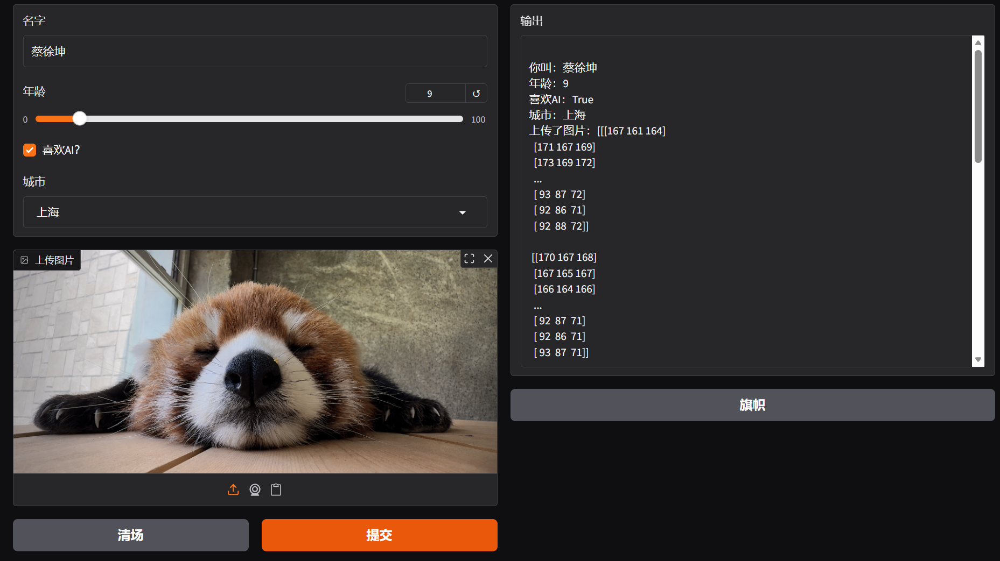

```
import gradio as gr

def greet(name, intensity):
    return "Hello, " + name + "!" * intensity

demo=gr.Interface(
    fn=greet,
    inputs=["text",gr.Slider(value=2,minimum=1,maximum=10,step=1)],
    outputs=[gr.Textbox(label="greeting",lines=3)],
    api_name="my_api2"
)
demo.launch()
```

然后gr后面跟的组件要首字母大写

minimum不是num

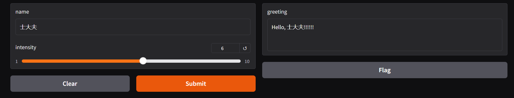

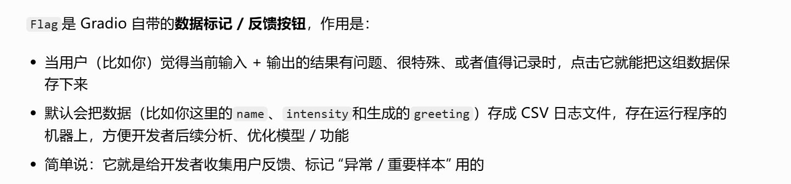

```
import numpy as np
import gradio as gr

def sepia(input_img):#复古滤镜
	#过滤器
    sepia_filter=np.array([
        [0.393, 0.769, 0.189],
        [0.349, 0.686, 0.168],
        [0.272, 0.534, 0.131]
    ])
    sepia_img=input_img.dot(sepia_filter.T)
    sepia_img/=sepia_img.max()
    return sepia_img

demo=gr.Interface(sepia,gr.Image(),"image",api_name="my_api4")
demo.launch()
```

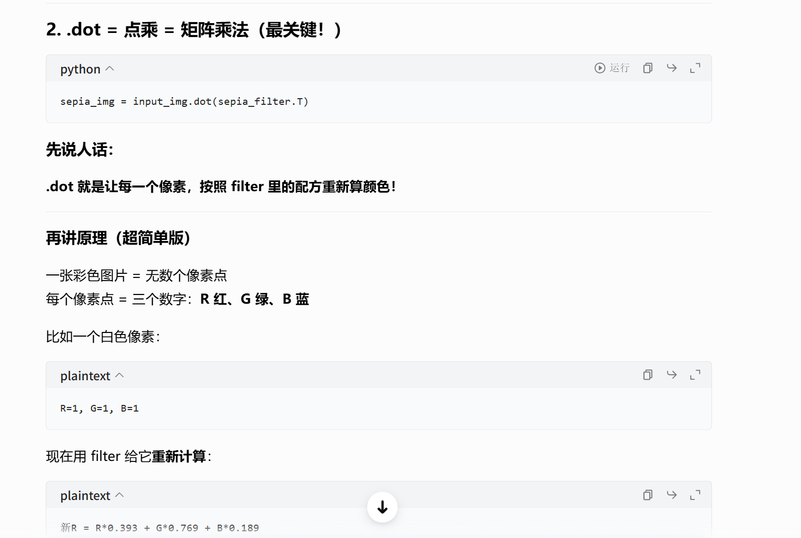

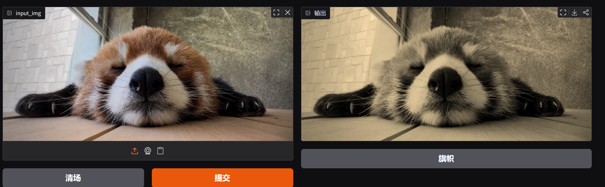

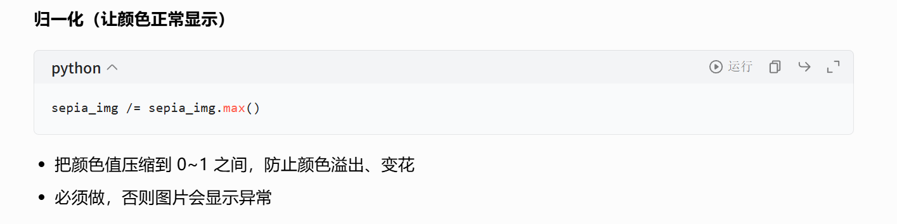

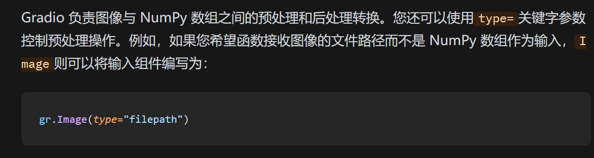

## 玩具计算机

```
import gradio as gr

def caculator(num1,operation,num2):
    if operation == "add":
        return num1+num2
    elif operation=="subtract":
        return num1 - num2
    elif operation == "multiply":
        return num1 * num2
    elif operation == "divide":
        if num2 == 0:
            raise gr.Error("Cannot divede by zero!")
        return num1 / num2

demo=gr.Interface(
    fn=caculator,
    inputs=[
        "number",
        gr.Radio(["add", "subtract", "multiply", "divide"]), # 单选按钮
        "number"
            ],
    outputs="number",
    examples=[# 示例（点一下就能自动填入）
        [45, "add", 3],
        [3.14, "divide", 2],
        [144, "multiply", 2.5],
        [0, "subtract", 1.2],
    ],
    title="Toy Calculator",
    description="Here's a sample toy calculator.",
    api_name="my_api5"
)

demo.launch()
```

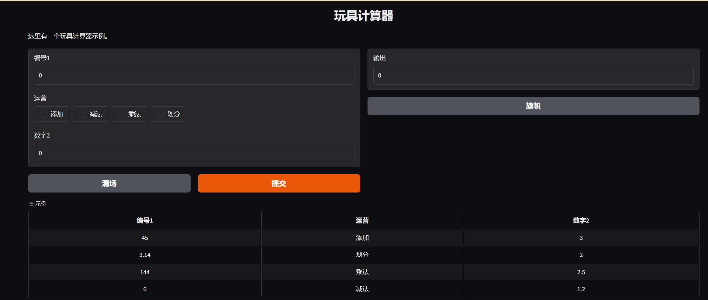

```
calculator,
    [
        "number",
        gr.Radio(["add", "subtract", "multiply", "divide"]),
        "number"
    ],
    "number",
```

函数输入输出名可以省略

```
gr.Number(label='Age', info='In years, must be greater than 0')
```

`info` = 输入框下方的灰色小字提示，用来指导用户怎么输入。

## 假生成器模板

演示「多输入 + 多输出」的界面怎么搭

```
import gradio as gr

def generate_fake_image(promot,seed,initial_image=None):
    return f"Used seed:{seed}","https://dummyimage.com/300/09f.png"

demo=gr.Interface(
    generate_fake_image,
    inputs=["textbox"],
    outputs=["textbox","image"],
    additional_inputs=[
        gr.Slider(0,1000),
        "image"
    ]
    api_name="my_api6"
)
demo.launch()
```

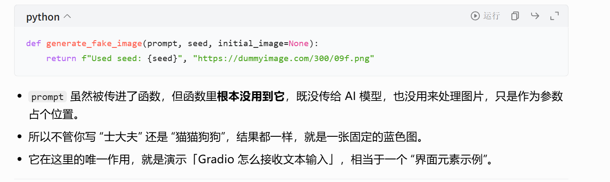

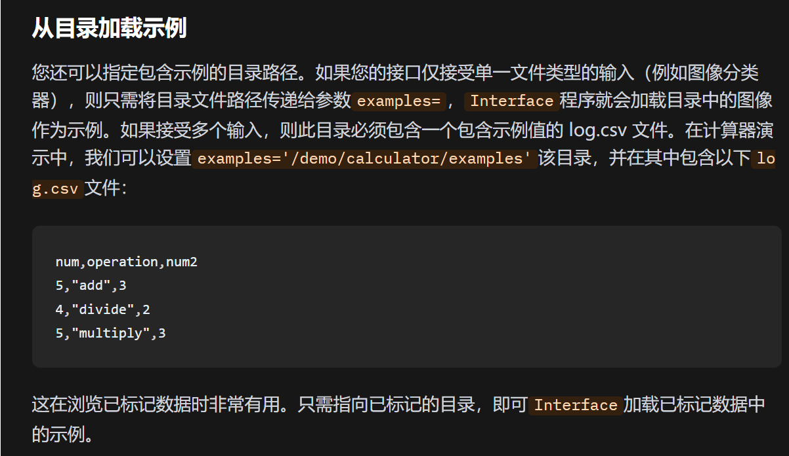

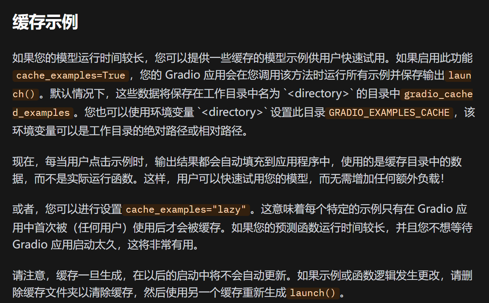

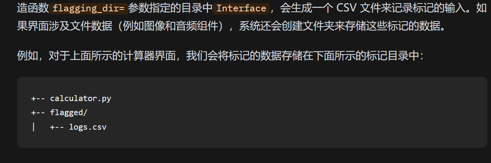

```
import gradio as gr
scores=[]

def track_score(score):
	scores.append(score)
	top_scores=sorted(scores,reverse=True)[:3]
	return top_scores
demo=gr.Interface(
	track_score,
	gr.Number(label="Score"),
	gr.JSON(label="Top Scores")
	api_name="my_api7"
)
```

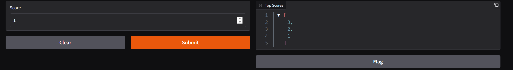

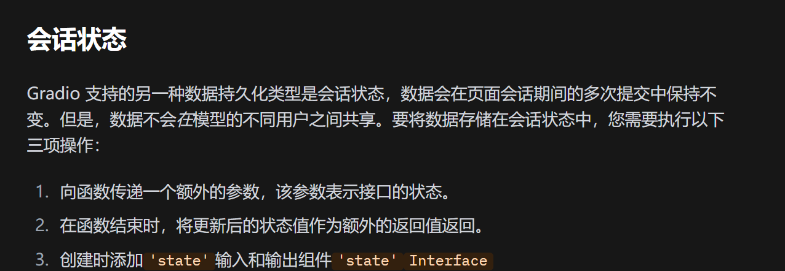

```
import gradio as gr

def store_message(message:str,history:list[str]):
	output={
		"Current messages":message,
        "Previous messages":history[::-1]
	}
	history.append(message)
	return ouput,history
demo=gr.Interface(
	fn=store_messages,
    inputs=["textbox",gr.State(value=[])],# 输入：看得见的输入框 + 看不见的State（初始空列表）
    outputs=["json",gr.State()], # 输出2：把更新后的状态传回给 State
	api_name="my_api8"
)

demo.launch()
```


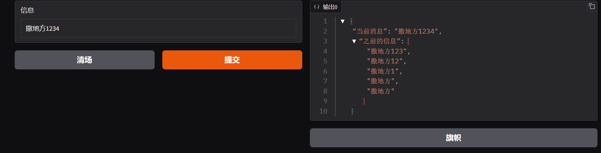


## 响应式页面

### 实时接口

您可以通过`live=True`在界面中进行设置，使界面自动刷新。这样，当用户输入发生变化时，界面将立即重新计算。

```python
import gradio as gr

def calculator(num1, operation, num2):
    if operation == "add":
        return num1 + num2
    elif operation == "subtract":
        return num1 - num2
    elif operation == "multiply":
        return num1 * num2
    elif operation == "divide":
        return num1 / num2

demo=gr.Interface(
    calculator,
    [
        "number",
        gr.Radio(["add", "subtract", "multiply", "divide"]),
        "number"
    ],
    "number",
    live=True
)
demo.launch()
```

请注意，这里没有提交按钮，因为界面会在更改时自动重新提交。

## 流组件

某些组件具有“流式传输”模式，例如`Audio`麦克风模式或`Image`摄像头模式。流式传输意味着数据会持续发送到后端，并且该`Interface`功能会持续重新运行。

```
import gradio as gr
import numpy as np

def flip(im):
    # 图片上下翻转
    return np.flipud(im)

demo=gr.Interface(
    flip,
    gr.Image(sources=["webcam"],streaming=True),# 输入：摄像头 + 实时流
    "image",
    live=True,
    api_name="my_api10",
)

demo.launch()
```

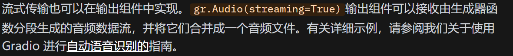

## 四种界面

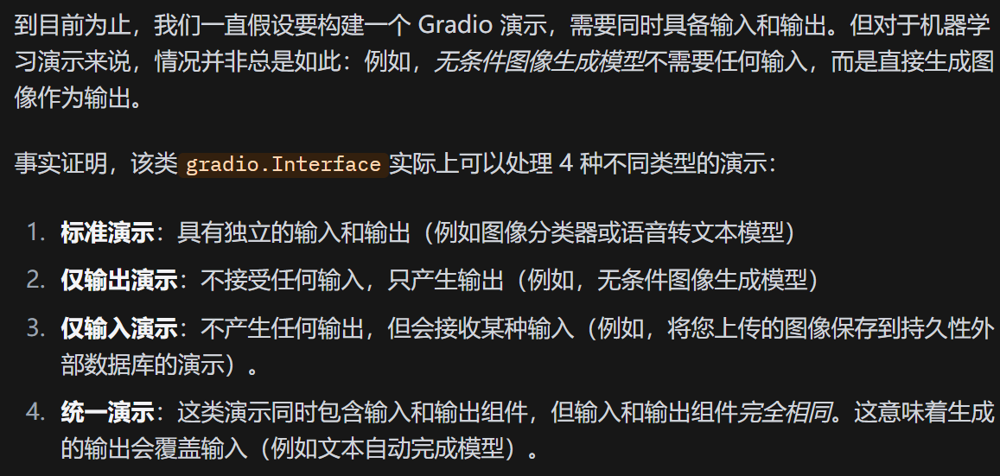

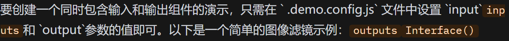

### 仅输出

```
import time
import gradio as gr

def fake_gan():
	time.sleep(1)
    images = [
            "https://images.unsplash.com/photo-1507003211169-0a1dd7228f2d?ixlib=rb-1.2.1&ixid=MnwxMjA3fDB8MHxwaG90by1wYWdlfHx8fGVufDB8fHx8&auto=format&fit=crop&w=387&q=80",
            "https://images.unsplash.com/photo-1554151228-14d9def656e4?ixlib=rb-1.2.1&ixid=MnwxMjA3fDB8MHxwaG90by1wYWdlfHx8fGVufDB8fHx8&auto=format&fit=crop&w=386&q=80",
            "https://images.unsplash.com/photo-1542909168-82c3e7fdca5c?ixlib=rb-1.2.1&ixid=MnwxMjA3fDB8MHxzZWFyY2h8MXx8aHVtYW4lMjBmYWNlfGVufDB8fDB8fA%3D%3D&w=1000&q=80",
    		]
```


### 仅输入

```
import random
import string
import gradio as gr

def save_image_random_name(image):
    # 生成20个随机字母 + .png
    random_string=''.join(random.choices(string.ascii_letters,k=20))+'.png'
    image.save(random_string)
    print(f"Saved image to {random_string}!")


demo=gr.Interface(
    fn=save_image_random_name,
    inputs=gr.Image(type="pil"),
    outputs=None,
    api_name="my_api12"
)
demo.launch()
```

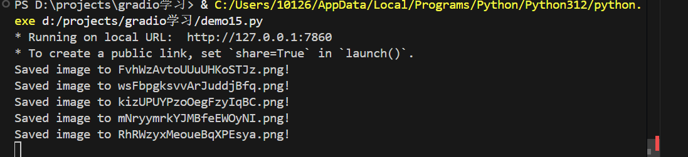

### 统一演示

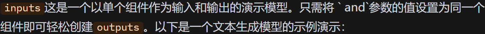

```
import gradio as gr
from transformers import pipeline

generator=pipeline('text-generation',model='gpt2')

def generate_next(text_prompt):
    response=generator(
        text_prompt,
        max_length=30,
        num_return_sequences=5 #一次性生成 5 条不同结果
        )
    return response[0]['generated_text']

demo=gr.Interface(
    generate_next,
    gr.Textbox(),
    gr.Textbox(),
    api_name="myapi_13"
)
demo.launch()
```

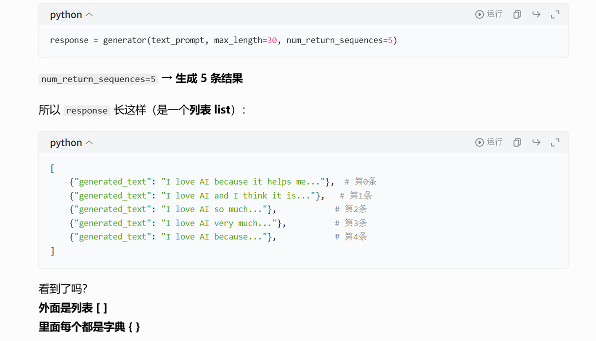

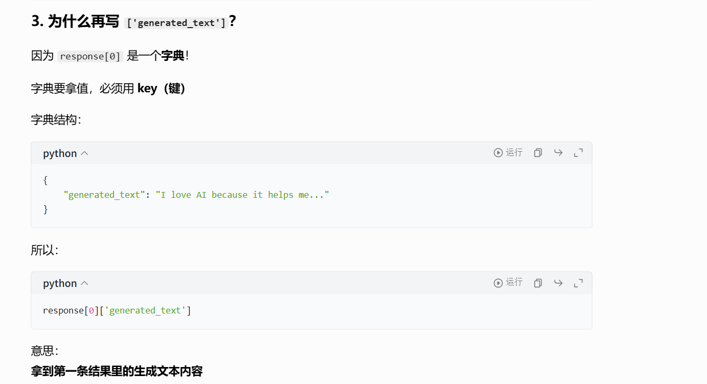

`transformers`是本地跑模型用的
