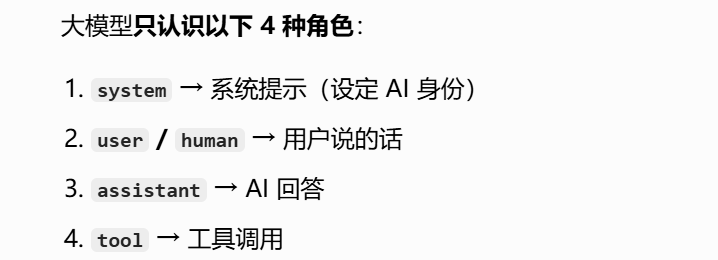
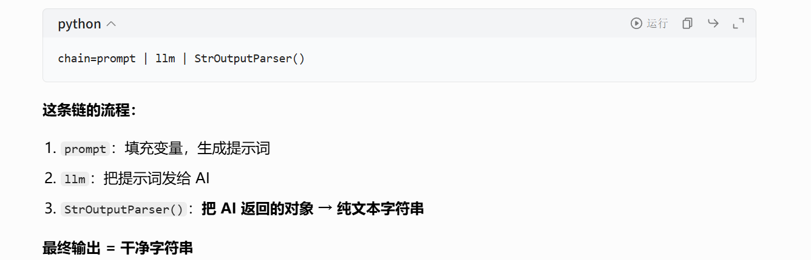
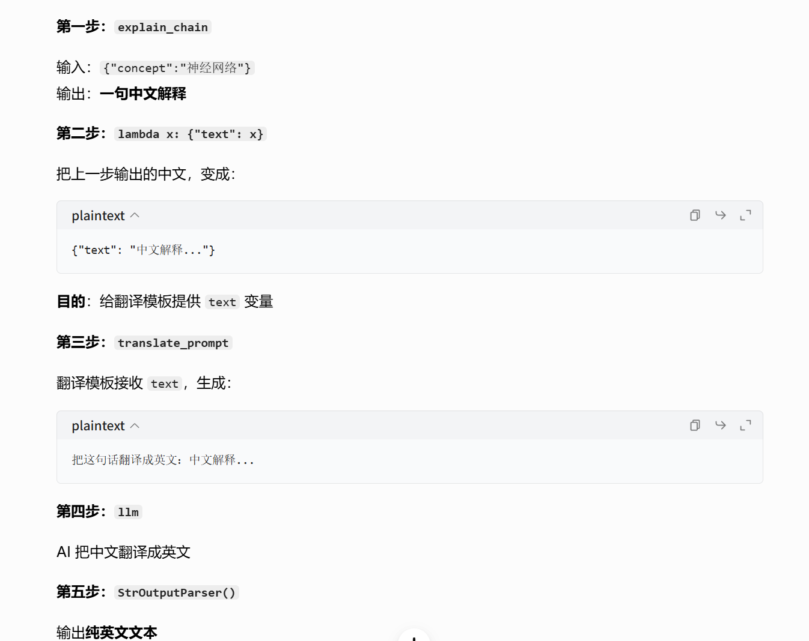

## 概念

LangChain 是一个让你更方便地用大模型做应用的框架，把常用的操作（调模型、读文档、检索、记忆、调工具）都封装好了，不用每次都从头写。

## LangChain 的核心组成

### model

```
from langchain_openai import ChatOpenAI
from langchain_core.messages import HumanMessage,SystemMessage

llm=ChatOpenAI(
    api_key="sk-pdoegctjndihnwvleajxkydpzzvhjeuagtaheyzerygxhusn",
    base_url="https://api.siliconflow.cn/v1",
    model="Pro/deepseek-ai/DeepSeek-V3.2"
)

response=llm.invoke("你好，介绍一下你自己")
# response 是完整返回对象,.content 才是文字回答
print(response.content)
print("---")

messages=[
    SystemMessage(content="你是一个python找专家"),
    HumanMessage(content="用一句话解释什么是装饰器")
]

response=llm.invoke(messages)
print(response.content)
```

传字符串等价于只有一条用户消息，没有系统提示。传消息列表可以同时设置 SystemMessage（角色设定）和 HumanMessage（用户输入），更灵活，实际项目里几乎都用第二种。

`response`是 对象，里面除了 文字内容，还有 （token用量、模型名等信息）。直接 print 会把整个对象打印出来，很乱。

```
# 标准导入写法
from langchain_core.messages import (
    SystemMessage,   # 系统消息：定义AI角色/规则
    HumanMessage,    # 用户消息：用户提问
    AIMessage,       # AI消息：大模型返回的回答
    ToolMessage,     # 工具消息：函数/工具调用的结果
)
```

## prompt

```
from langchain_openai import ChatOpenAI
from langchain_core.prompts import ChatPromptTemplate

llm=ChatOpenAI(
    api_key="sk-pdoegctjndihnwvleajxkydpzzvhjeuagtaheyzerygxhusn",
    base_url="https://api.siliconflow.cn/v1",
    model="Pro/deepseek-ai/DeepSeek-V3.2"
)

template=ChatPromptTemplate.from_messages([
    ("system","你是要给{role}专家"),
    ("human","请用一句话解释{concept}")]
)

messages=template.invoke({
    "role":"Python",
    "concept":"装饰器"
})
print("生成的消息：")
print(messages)
print("---")

response=llm.invoke(messages)
print("模型回答：")
print(response.content)
print("---")

messages2=template.invoke({
    "role":"机器学习",
    "concept":"过拟合"
})
response2=llm.invoke(messages2)
print(response2.content)

```

```
生成的消息：
messages=[SystemMessage(content='你是要给Python专家'), HumanMessage(content='请用一句话解释装饰器')]
---
模型回答：
装饰器是给函数动态添加功能而不修改其源码的语法糖。
---
过拟合是指模型在训练数据上表现过于完美，以至于学习了训练数据中的噪 声和偶然特征，导致其在新的、未见过的数据上表现不佳。
```

为什么需要模板？

```
prompt=f"请用{language}语言解释{concept}"

template="请用{language}语言解释{concept}"
```

**第一个：为什么用元组而不是字符串**

直接用字符串只能有一条消息，无法区分角色：

```
# 字符串：只能是单条用户消息
ChatPromptTemplate.from_template("解释{concept}")

# 元组列表：可以定义多条不同角色的消息
ChatPromptTemplate.from_messages([
    ("system", "你是专家"),  # 系统消息
    ("human", "{concept}"),  # 用户消息
    ("ai", "好的"),          # 可以加AI的历史回复
    ("human", "再详细点"),   # 再加一条用户消息
])
```

**第二个：忘传变量会报错**

```python
# 模板需要 role 和 concept 两个变量
# 如果只传一个
messages = template.invoke({"role": "Python"})
# → KeyError: concept 直接报错
```

这其实是模板的优点，强制你把所有变量都填上，不会漏掉。



### chain

这是 LangChain 最核心的概念，用 管道符把步骤串起来：`|`

```
prompt | llm | output_parser
```

就想Linux管道：

```
cat file.txt | grep "关键词" | sort
```

```
from langchin_openai import ChatOpenAI
from langchin_core.prompts import ChatPromptTemplate
from langchin_core.ouput_parsers import StrOuputParser# 转成纯字符串

llm=ChatOpenAI(
	api_key="sk-pdoegctjndihnwvleajxkydpzzvhjeuagtaheyzerygxhusn",
    base_url="https://api.siliconflow.cn/v1",
    model="Pro/deepseek-ai/DeepSeek-V3.2"
)
prompt=ChatPromptTemplate.from_messages([
	("system","你是一个{role}专家"),
	("human","{question}")
])

chain= prompt | llm | StrOutputParser()
result=chain.invoke({
	"role":"大模型",
	"question":"什么是langgraph"
})
print("结果：", result)
print(type(result))  # 注意：现在直接是字符串了
print("---")

result2=chain.invoke({
	"role":"Linux",
	"question":"有哪些运维常用的软件"
})
print("结果2：", result2)
print("---")

# ===== 3. 多步骤链：第一步的输出作为第二步的输入 =====
explain_prompt=ChatPromptTemplate.from_messages([
	("human","用一句话就解释{concept}")
])
translate_prompt=ChatPromptTemplate.from_messages([
	("human","把这句话翻译成英文:{text}")
])

# 两个链串起来
from langchin_core.runnables import RunnablePassThrough

explain_chain=explain_prompt | llm | StrOutputParser()

full_chain=(
	explain_chain
	| (lambda x:{"text":x})
	| translate_chain
	| llm
	| StrOutPutParser()
)
result3=full_chain.invoke({
	"concept":"神经网络"
})
print("先解释再翻译：",result3)
```

`output_parsers`

- 翻译：**输出解析器**
- 作用：**把 AI 返回的复杂结果 → 变成干净的字符串**

`import StrOutputParser`

- **Str = String（字符串）**

- **OutputParser = 输出解析器**

- 合起来意思：

	把 AI 返回的乱七八糟对象 → 转成纯文本字符串

	

	````
	果： 好的，非常乐意为您详细解释 LangGraph。
	
	简单来说，**LangGraph 是一个由 LangChain 团队开发的、用于构建复杂、有状态的多步骤应用（特别是Agent和“工作流”）的框架。**
	
	让我们把它拆解开来理解：
	
	### 核心概念：图
	
	LangGraph 的核心思想是将您的应用程序建模为一个**图**。
	*   **节点**：图中的每个节点代表一个执行步骤或一个功能。这可以是一 个简单的函数、一个 LangChain 的链、一个工具调用，甚至另一个图。
	*   **边**：边定义了节点之间的流转逻辑。它决定了“在完成这个节点后，下一步应该执行哪个节点？”。
	
	这种“图”的思维方式非常适合描述那些不完全是线性流程、可能包含循环、 条件分支和多参与者协作的应用。
	
	### 为什么需要 LangGraph？（它能解决什么问题？）
	
	在 LangGraph 出现之前，构建复杂的 Agent（智能体）或工作流通常需要编写大量手动的、难以维护的状态管理代码。例如：
	
	1.  **Agent 的循环问题**：一个经典的 ReAct 模式 Agent 需要“思考 -> 行动 -> 观察 -> 再思考...”的循环，直到任务完成。用传统代码写这个循 环和状态管理比较繁琐。
	2.  **复杂的工作流**：比如一个客服系统，可能需要根据用户意图，在“查询知识库”、“生成回答”、“转接人工”、“请求更多信息”等多个步骤间跳转。
	3.  **多角色协作**：模拟一个团队，有“研究员”、“写手”、“审阅者”等不 同角色，它们需要按顺序或并行工作，并传递和修改共享的“草稿”。       
	
	**LangGraph 通过将状态和流程显式地定义为图结构，优雅地解决了这些问 题。**
	
	### 关键特性
	
	1.  **有状态**：这是 LangGraph 的灵魂。它维护一个共享的**状态对象**（通常是一个字典），这个状态会在整个图的执行过程中被各个节点读取和 修改。你无需自己管理全局变量或复杂的上下文传递。
	2.  **循环与条件边**：你可以轻松地创建循环（比如让 Agent 一直运行直到满足某个条件），也可以根据当前状态的值，决定下一步走哪条边（“如果用户生气了，转到安抚节点；否则，转到处理节点”）。
	3.  **人性与中断**：它内置了对“人工介入”的支持。流程可以在特定节点 暂停，等待外部输入（比如人类审核批准），然后再继续执行。这对于关键 业务审批流程至关重要。
	4.  **可持久化与流式输出**：执行状态可以轻松保存到数据库，之后可以 从中断点恢复。同时，它也支持流式返回每个节点的结果，让用户能看到“思考过程”。
	5.  **与 LangChain 深度集成**：它无缝使用 LangChain 的模型、工具、 检索器等生态组件，但**它本身不绑定 LangChain**，你也可以用它来编排 非 LangChain 的函数。
	
	### 核心组件
	
	1.  **StateGraph**：这是你构建图的起点。你需要定义一个状态模式，规 定你的状态对象里有哪些字段。
	2.  **节点**：一个接收当前状态、执行操作、并返回一个状态更新（字典 ）的函数。
	3.  **边**：
	    *   **起始边**：定义入口节点。
	    *   **普通边**：从一个节点指向另一个节点。
	    *   **条件边**：基于状态值，动态决定下一个节点。
	4.  **编译**：在你添加完所有节点和边后，需要将其“编译”成一个可执行 的计算图。
	
	### 一个简单比喻
	
	想象一个办理银行业务的流程图：
	*   **节点**：取号、柜台办理、风险评估、经理审批、完成。
	*   **边**：取号后去“柜台办理”。柜台办理后，如果金额小，直接去“完成”；如果金额大，需要去“经理审批”，审批后再回到“柜台办理”或去“完成”。
	*   **状态**：你手里的“业务申请单”，上面记录了你的需求、已完成的步 骤、审批结果等信息。每个节点都会查看并修改这张单子。
	
	LangGraph 就是帮你绘制和执行这个流程图的工具。
	
	### 代码示例（超简版概念）
	
	下面是一个超级简化的伪代码，展示如何构建一个具有循环能力的 Agent： 
	
	```python
	from langgraph.graph import StateGraph, END
	from typing import TypedDict
	
	# 1. 定义状态结构
	class AgentState(TypedDict):
	    question: str       # 用户问题
	    thought: str        # Agent的思考
	    action: str         # 要采取的行动
	    observation: str    # 行动的结果
	    answer: str         # 最终答案
	
	# 2. 创建图
	graph_builder = StateGraph(AgentState)
	
	# 3. 定义节点函数
	def think_node(state):
	    # 根据问题，生成思考和下一步行动
	    return {"thought": "我需要搜索...", "action": "search"}        
	
	def act_node(state):
	    # 执行 action (如调用搜索工具)，得到结果
	    return {"observation": "搜索结果是..."}
	
	def answer_node(state):
	    # 根据所有信息，生成最终答案
	    return {"answer": "最终答案是..."}
	
	# 4. 添加节点
	graph_builder.add_node("think", think_node)
	graph_builder.add_node("act", act_node)
	graph_builder.add_node("answer", answer_node)
	
	# 5. 设置边和条件
	graph_builder.set_entry_point("think")
	# think 后总是执行 act
	graph_builder.add_edge("think", "act")
	# act 后，判断是否需要继续思考
	def should_continue(state):
	    if state["observation"] == "足够回答了":
	        return "answer"  # 去回答节点
	    else:
	        return "think"   # 回到思考节点，继续循环
	
	graph_builder.add_conditional_edges("act", should_continue)        
	graph_builder.add_edge("answer", END) # 结束
	
	# 6. 编译并运行
	app = graph_builder.compile()
	final_state = app.invoke({"question": "什么是LangGraph？"})        
	print(final_state["answer"])
	```
	
	### 总结
	
	**LangGraph 是一个强大的工作流编排框架**，它特别适用于构建：       
	*   **复杂的、有状态的 AI Agent**
	*   **多步骤的自动化业务流程**
	*   **需要人工审核或决策的混合工作流**
	*   **模拟多角色协作系统**
	
	如果你熟悉 LangChain，可以把它看作是 LangChain 的“高级模式”，专门用于解决更复杂、更结构化的应用场景。即使不使用 LangChain 的其他部分，其“基于图和有状态”的设计思想也极具价值。
	<class 'str'>
	---
	结果2： 作为Linux专家，以下是一些运维常用的命令，按功能分类整理：
	
	---
	
	## 🔍 **系统信息**
	- **`uname -a`** – 显示系统详细信息
	- **`hostname`** – 查看主机名
	- **`lscpu`** – 显示CPU信息
	- **`free -h`** – 查看内存使用情况（人类可读格式）
	- **`df -h`** – 查看磁盘空间使用情况
	- **`uptime`** – 显示系统运行时间与负载
	
	---
	
	## 🚀 **进程管理**
	- **`ps aux`** – 查看所有运行进程
	- **`top` / `htop`** – 实时进程监控（htop为增强版）
	- **`kill -9 <PID>`** – 强制终止进程
	- **`pkill <进程名>`** – 按名称终止进程
	- **`jobs` / `bg` / `fg`** – 后台/前台任务管理
	
	---
	
	## 📦 **包管理**
	### *Debian/Ubuntu*
	- **`apt update && apt upgrade`** – 更新软件包列表并升级
	- **`apt install <包名>`** – 安装软件包
	- **`apt remove <包名>`** – 卸载软件包
	
	### *RHEL/CentOS*
	- **`yum update`** – 更新软件包
	- **`yum install <包名>`** – 安装软件包
	
	---
	
	## 📡 **网络相关**
	- **`ping <IP或域名>`** – 测试网络连通性
	- **`netstat -tuln`** – 查看监听端口
	- **`ss -tuln`** – 更快速的端口查看（替代netstat）
	- **`curl <URL>`** – 发送HTTP请求
	- **`wget <URL>`** – 下载文件
	- **`traceroute <目标>`** – 跟踪网络路径
	- **`nslookup <域名>`** – DNS查询
	- **`dig <域名>`** – DNS详细信息查询
	
	---
	
	## 🔧 **文件与目录**
	- **`ls -la`** – 列出所有文件（含隐藏文件）
	- **`find /path -name "*.log"`** – 查找文件
	- **`grep "关键词" file`** – 在文件中搜索文本
	- **`tail -f /var/log/syslog`** – 实时查看日志文件
	- **`tar -czvf archive.tar.gz /path`** – 压缩文件
	- **`chmod 755 file`** – 修改文件权限
	- **`chown user:group file`** – 修改文件所有者
	
	---
	
	## 🛠️ **系统服务**
	- **`systemctl status <服务名>`** – 查看服务状态（Systemd）        
	- **`systemctl start/stop/restart <服务名>`** – 启动/停止/重启服务 
	
	- **`journalctl -u <服务名>`** – 查看服务日志
	
	---
	
	## 🔐 **用户管理**
	- **`useradd <用户名>`** – 创建新用户
	- **`passwd <用户名>`** – 修改用户密码
	- **`usermod -aG group user`** – 将用户添加到组
	- **`sudo <命令>`** – 以超级用户权限执行命令
	
	---
	
	## 📊 **性能监控**
	- **`vmstat 1`** – 查看系统资源使用情况（每秒刷新）
	- **`iostat`** – 磁盘I/O统计
	- **`sar`** – 系统活动报告（需安装sysstat）
	- **`dmesg | tail`** – 查看内核日志
	
	---
	
	## 🛡️ **安全相关**
	- **`last`** – 查看登录记录
	- **`who` / `w`** – 查看当前登录用户
	- **`iptables -L`** – 查看防火墙规则
	- **`fail2ban-client status`** – 查看Fail2Ban状态
	
	---
	
	如果你有特定的运维场景（如故障排查、性能调优、日志分析等），我可以 提供更详细的命令组合和操作示例！
	---
	先解释再翻译： A neural network is a type of machine learning model that mimics the connection patterns of neurons in the human brain. It learns complex patterns by performing nonlinear transformations on input data through multiple layers of computational units.     
	PS D:\projects\langchain框架学习> 
	````





### document


vectorstore


agent

