## 简介

Transformers 作为最先进的机器学习模型（包括文本、计算机视觉、音频、视频和多模态模型）的模型定义框架，用于推理和训练。

它集中管理模型定义，以便整个生态系统都能达成共识。`transformers`它是跨框架的枢纽：如果一个模型定义得到支持，它将与大多数训练框架（Axolotl、Unsloth、DeepSpeed、FSDP、PyTorch-Lightning 等）、推理引擎（vLLM、SGLang、TGI 等）以及利用该模型定义的相邻建模库（llama.cpp、mlx 等）兼容`transformers`。

1. 快速易用：每个模型仅由三个主要类（配置、模型和预处理器）实现，可快速用于使用[Pipeline](https://huggingface.co/docs/transformers/v5.9.0/en/main_classes/pipelines#transformers.Pipeline)或[Trainer](https://huggingface.co/docs/transformers/v5.9.0/en/main_classes/trainer#transformers.Trainer)进行推理或训练。
2. 预训练模型：使用预训练模型而非训练全新模型，可减少碳排放，并节省成本和时间。每个预训练模型都尽可能地还原原始模型，并提供一流的性能。

- [Pipeline](https://huggingface.co/docs/transformers/pipeline_tutorial)：简单且优化的推理类，适用于许多机器学习任务，例如文本生成、图像分割、自动语音识别、文档问答等。
- [训练器](https://huggingface.co/docs/transformers/trainer)：一个综合性的训练器，支持混合精度、torch.compile 和 FlashAttention 等功能，用于 PyTorch 模型的训练和分布式训练。
- [生成](https://huggingface.co/docs/transformers/llm_tutorial)：使用大型语言模型 (LLM) 和视觉语言模型 (VLM) 快速生成文本，包括支持流式传输和多种解码策略。

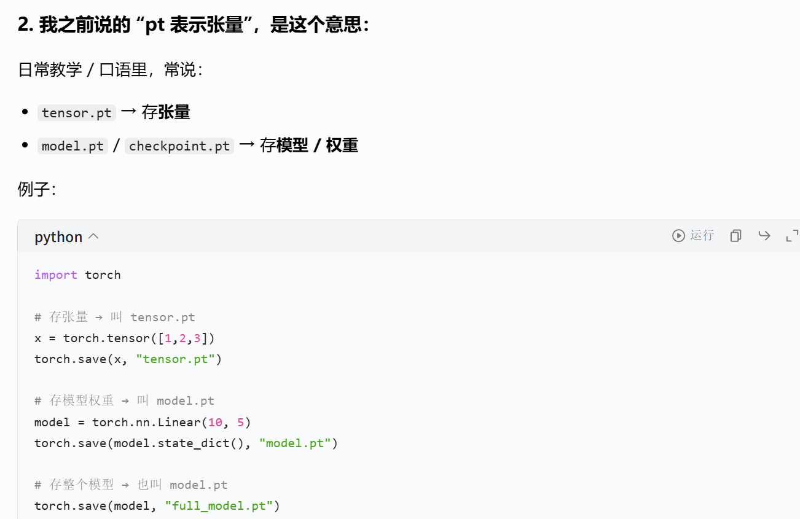

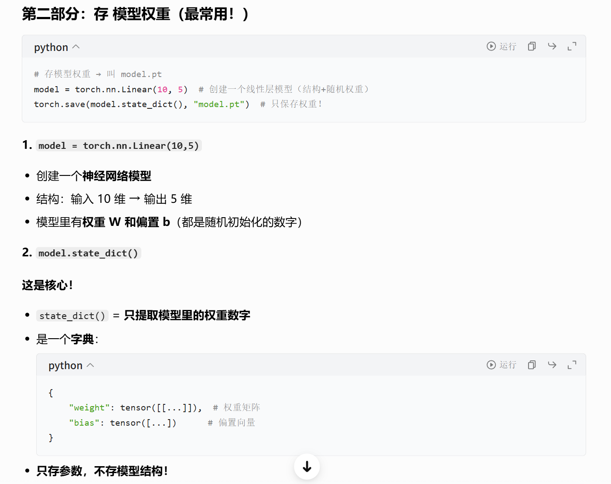

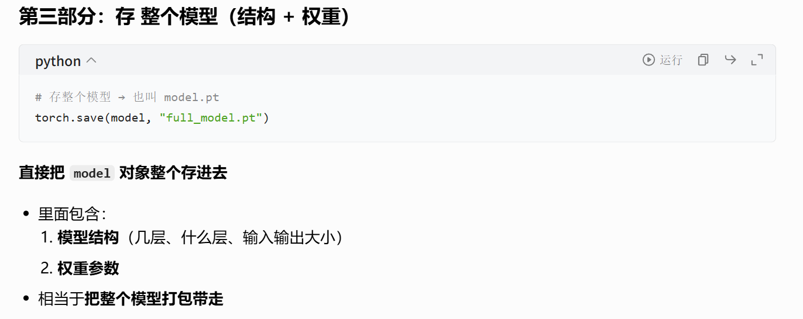

```
import torch

# 存张量 → 叫 tensor.pt
x = torch.tensor([1,2,3])
torch.save(x, "tensor.pt")

# 存模型权重 → 叫 model.pt
model = torch.nn.Linear(10, 5)
torch.save(model.state_dict(), "model.pt")

# 存整个模型 → 也叫 model.pt
torch.save(model, "full_model.pt")
```

重复运行是覆盖

```
# 加载
x = torch.load("tensor.pt")
print("tensor.pt 里的内容：")
print(x)
print("类型：", type(x))

# 加载
state_dict = torch.load("model.pt")
print("model.pt 里的内容：")
print(state_dict)
print("类型：", type(state_dict))

model = torch.load("full_model.pt")
print("full_model.pt 里的内容：")
print(model)
print("类型：", type(model))
```

```
d:\projects\huggingface生态\demo6.py:15: FutureWarning: You are using `torch.load` with `weights_only=False` (the current default value), which uses the default pickle module implicitly. It is possible to construct malicious pickle data which will execute arbitrary code during unpickling (See https://github.com/pytorch/pytorch/blob/main/SECURITY.md#untrusted-models for more details). In a future release, the default value for `weights_only` will be flipped to `True`. This limits the functions that could be executed during unpickling. Arbitrary objects will no longer be allowed to be loaded via this mode unless they are explicitly allowlisted by the user via `torch.serialization.add_safe_globals`. We recommend you start setting `weights_only=True` for any use case where you don't have full control of the loaded file. Please open an issue on GitHub for any issues related to this experimental feature.
  x = torch.load("tensor.pt")
tensor.pt 里的内容：
tensor([1, 2, 3])
类型： <class 'torch.Tensor'>
d:\projects\huggingface生态\demo6.py:21: FutureWarning: You are using `torch.load` with `weights_only=False` (the current default value), which uses the default pickle module implicitly. It is possible to construct malicious pickle data which will execute arbitrary code during unpickling (See https://github.com/pytorch/pytorch/blob/main/SECURITY.md#untrusted-models for more details). In a future release, the default value for `weights_only` will be flipped to `True`. This limits the functions that could be executed during unpickling. Arbitrary objects will no longer be allowed to be loaded via this mode unless they are explicitly allowlisted by the user via `torch.serialization.add_safe_globals`. We recommend you start setting `weights_only=True` for any use case where you don't have full control of the loaded file. Please open an issue on GitHub for any issues related to this experimental feature.
  state_dict = torch.load("model.pt")
model.pt 里的内容：
OrderedDict({'weight': tensor([[-0.2247, -0.0827, -0.2621,  0.2682,  0.2837,  0.1413,  0.2813, -0.0075,
          0.0633, -0.0240],
        [ 0.2060,  0.0149,  0.2114, -0.2313,  0.1611,  0.0753, -0.1599,  0.2220,
         -0.1510,  0.2089],
        [-0.1701, -0.2376,  0.1254, -0.0639, -0.2236,  0.0664,  0.1195,  0.3157,
         -0.1365, -0.0803],
        [-0.0201, -0.0930, -0.1107, -0.3140,  0.1646, -0.2212, -0.0624,  0.1429,
          0.1300, -0.0793],
        [-0.2613, -0.1264,  0.2235, -0.2732, -0.2275, -0.0657, -0.0793,  0.2339,
         -0.2683, -0.1352]]), 'bias': tensor([ 0.1247, -0.2436, -0.2200,  0.0272,  0.1589])})
类型： <class 'collections.OrderedDict'>
d:\projects\huggingface生态\demo6.py:26: FutureWarning: You are using `torch.load` with `weights_only=False` (the current default value), which uses the default pickle module implicitly. It is possible to construct malicious pickle data which will execute arbitrary code during unpickling (See https://github.com/pytorch/pytorch/blob/main/SECURITY.md#untrusted-models for more details). In a future release, the default value for `weights_only` will be flipped to `True`. This limits the functions that could be executed during unpickling. Arbitrary objects will no longer be allowed to be loaded via this mode unless they are explicitly allowlisted by the user via `torch.serialization.add_safe_globals`. We recommend you start setting `weights_only=True` for any use case where you don't have full control of the loaded file. Please open an issue on GitHub for any issues related to this experimental feature.
  model = torch.load("full_model.pt")
full_model.pt 里的内容：
Linear(in_features=10, out_features=5, bias=True)
类型： <class 'torch.nn.modules.linear.Linear'>
```

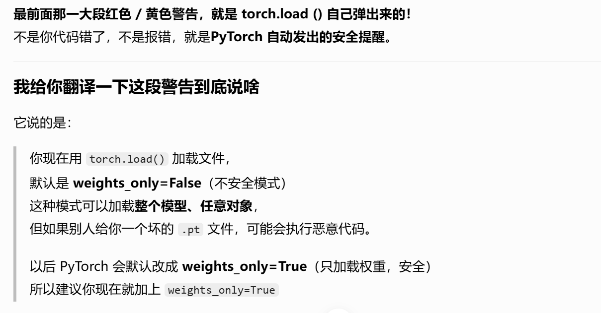

## 安装

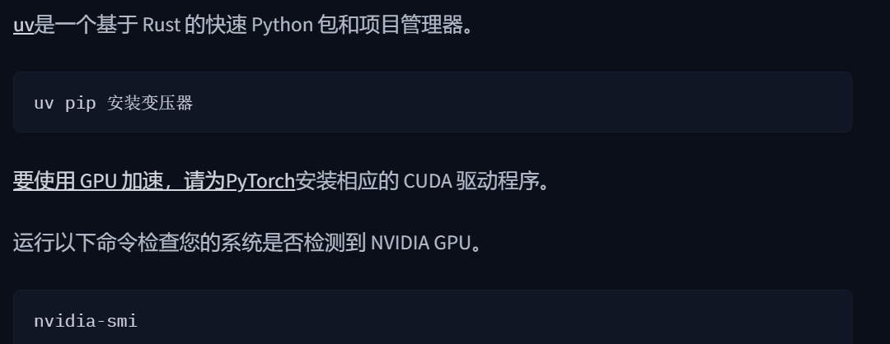

## [创建一个用户访问令牌](https://hf.co/docs/hub/security-tokens#user-access-tokens)并登录您的账户

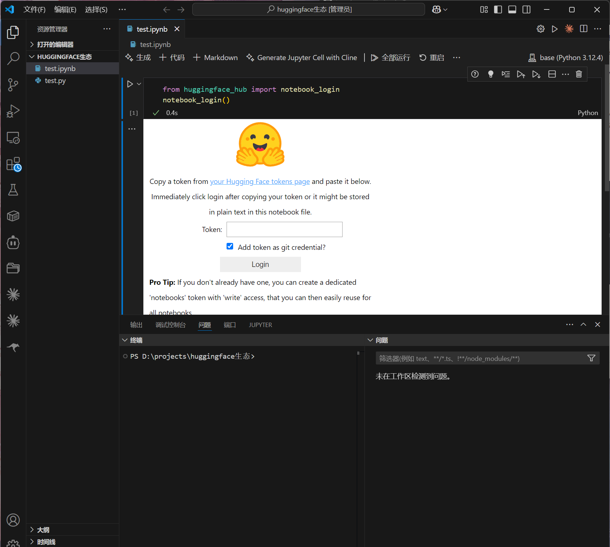

创建令牌后登录，然后终端测试

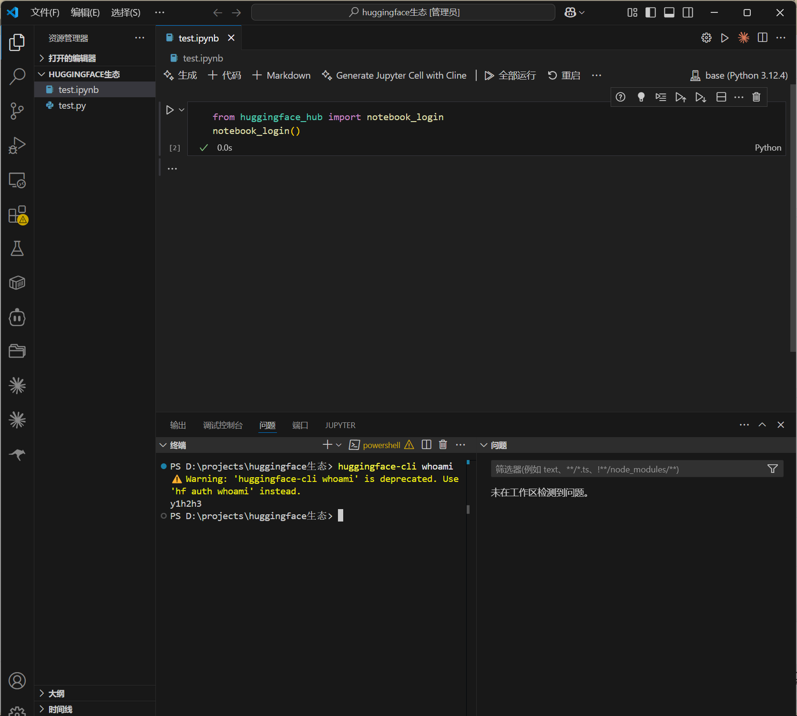

## 预训练模型

每个预训练模型继承三个基类。

### [PreTrainedConfig](https://huggingface.co/docs/transformers/v5.9.0/en/main_classes/configuration#transformers.PreTrainedConfig)

一个指定模型属性的文件，如注意力头数或词汇量。

### [PreTrainedModel](https://huggingface.co/docs/transformers/v5.9.0/en/main_classes/model#transformers.PreTrainedModel)

由配置文件中的模型属性定义的模型（或架构）。预训练模型只返回原始隐藏状态。针对特定任务，使用相应的模型头将原始隐藏状态转换为有意义的结果（例如，[LlamaModel](https://huggingface.co/docs/transformers/v5.9.0/en/model_doc/llama#transformers.LlamaModel) 与 [LlamaForCausalLM](https://huggingface.co/docs/transformers/v5.9.0/en/model_doc/llama#transformers.LlamaForCausalLM) 的区别）。

### Preprocessor

一个将原始输入（文本、图片、音频、多模态）转换为模型数值输入的类。例如，[PreTrainedTokenizer](https://huggingface.co/docs/transformers/v5.9.0/en/main_classes/tokenizer#transformers.PythonBackend) 将文本转换为张量，[ImageProcessingMixin](https://huggingface.co/docs/transformers/v5.9.0/en/main_classes/image_processor#transformers.ImageProcessingMixin) 将像素转换为张量。

我们建议使用 [AutoClass](https://huggingface.co/docs/transformers/model_doc/auto) API 加载模型和预处理器，因为它会自动根据预训练权重的名称或路径及配置文件推断出每个任务和机器学习框架的合适架构。

使用 [from_pretrained（）](https://huggingface.co/docs/transformers/v5.9.0/en/main_classes/model#transformers.PreTrainedModel.from_pretrained) 将权重和配置文件从集线器加载到模型和预处理器类中。

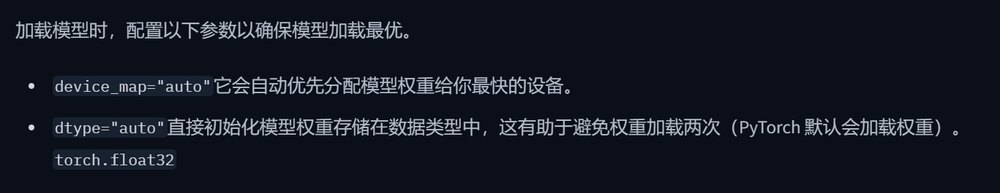

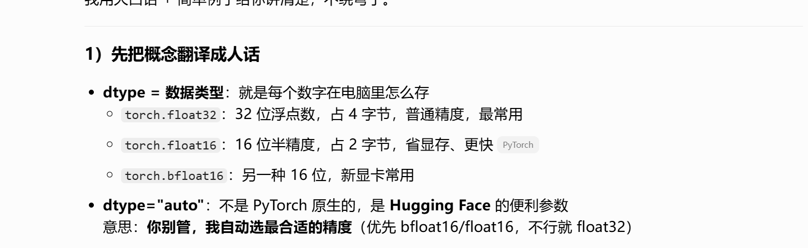

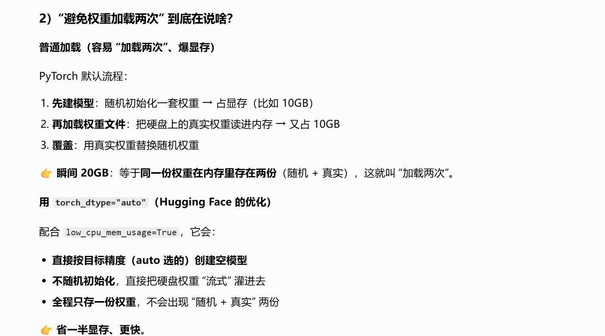

`float32` = 安全但费显存

`auto` = 聪明，尽量用更省的精度，不行再回退到 float32

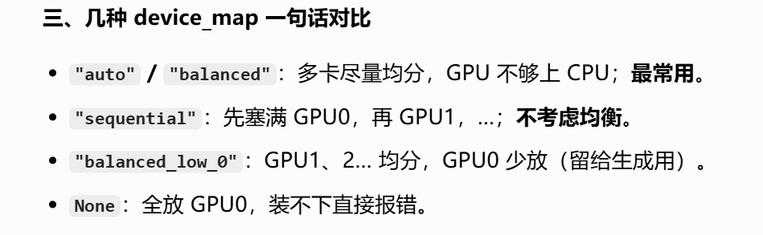

```
from transformers import AutoModelForCausalLM,AutoTokenizer

model_name = "TinyLlama/TinyLlama-1.1B-Chat-v1.0"

model=AutoModelForCausalLM.from_pretrained(
	model_name,
	dtype="auto",
	device_map="auto"
)
tokenizer=AutoTokenizer.from_pretrained(model_name)

prompt = "The secret to baking a good cake is "

model_inputs=tokenizer(prompt,return_tensors="pt").to(model.device)

generated_ids=model.generate(**model_inputs,max_length=30)
result=tokenizer.decode(generated_ids[0],skip_special_tokens=True)
print(result)
```

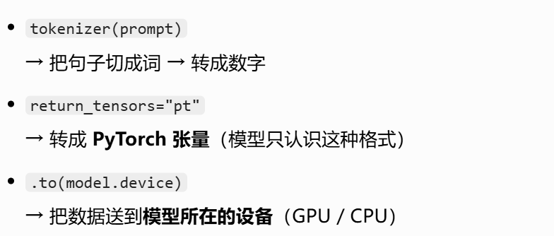

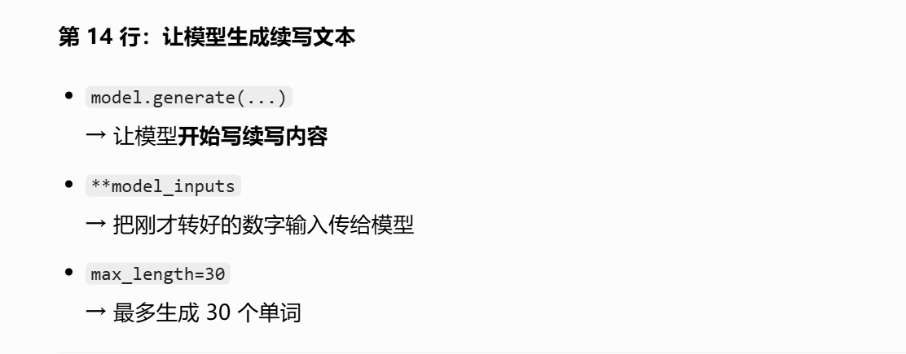

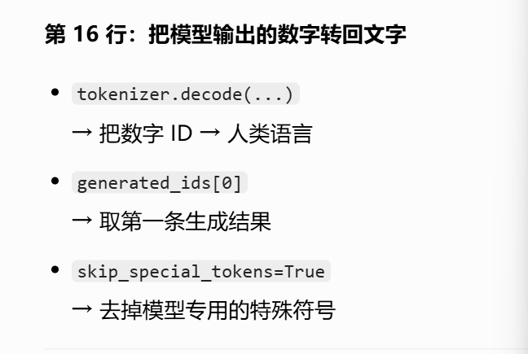

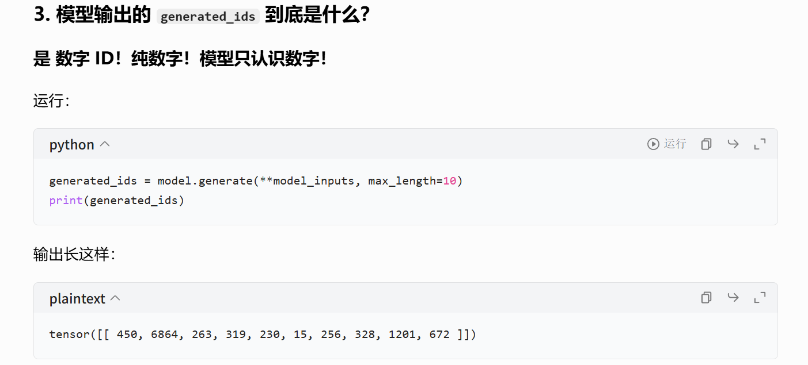

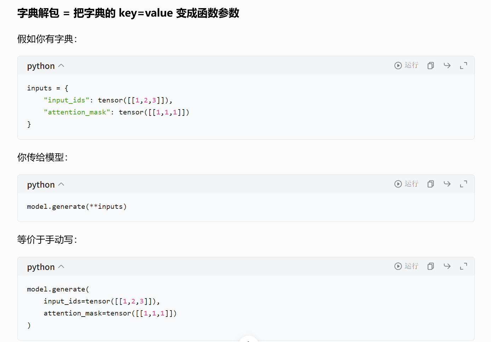

## pipline

流水线是利用模型进行推理的简单且优秀的方式。这些管道是抽象大部分 的对象 库中的复杂代码，提供了一个简单的 API，专门用于多个任务，包括命名实体 识别、隐蔽语言建模、情感分析、特征提取和问答。请参阅[任务摘要](https://huggingface.co/docs/transformers/task_summary)中的使用示例。

 [pipeline()](https://huggingface.co/docs/transformers/v5.9.0/en/main_classes/pipelines#transformers.pipeline)是封装所有其他管道的最强大对象。

针对[音频](https://huggingface.co/docs/transformers/main_classes/pipelines#audio)、[计算机视觉](https://huggingface.co/docs/transformers/main_classes/pipelines#computer-vision)、[自然语言处理](https://huggingface.co/docs/transformers/main_classes/pipelines#natural-language-processing)和[多模态](https://huggingface.co/docs/transformers/main_classes/pipelines#multimodal)任务提供了任务专用流水线。

它能自动下载模型、自动处理分词、自动输出结果

```
from transforemers import pipeline
pipe=pipeline("text-calssification")
result=pipe("This restaurant is awesome")
print(result)
```

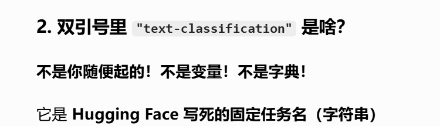

Device set to use cuda:0
[{'label': 'POSITIVE', 'score': 0.9998743534088135}]

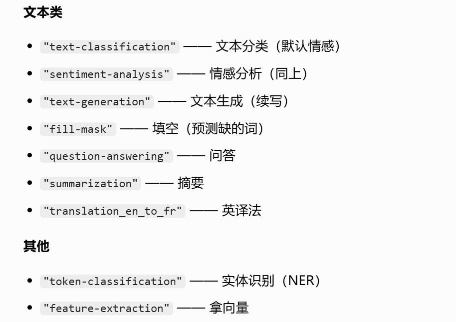

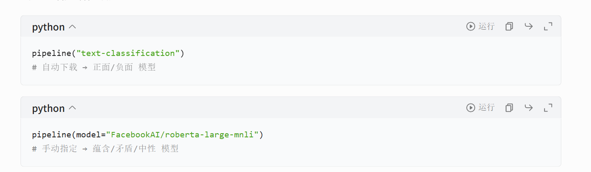

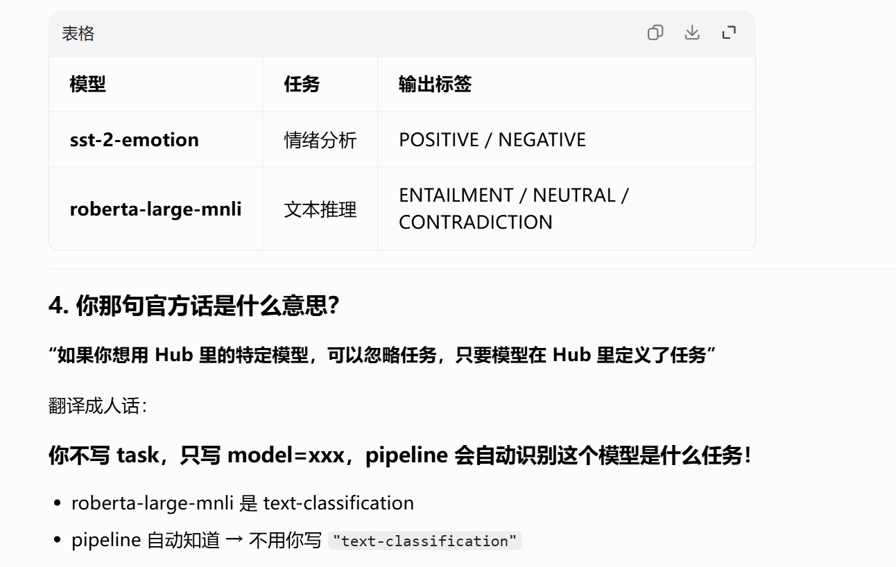

如果想用特定模型，可以忽略该任务

```python
pipe=pipeline(model="FacebookAI/roberta-large-mnli")
```

[{'label': 'NEUTRAL', 'score': 0.7313136458396912}]

要调用多个项目的流水线，可以用列表调用

```
pipe = pipeline("text-classification")
pipe(["This restaurant is awesome", "This restaurant is awful"])
```

要遍历完整数据集，建议直接使用。这意味着你不需要分配资金 整个数据集一次性处理，也不需要自己批处理。这应该和自定义循环一样快 显卡。

```
import datasets
from transformers import pipeline
from transformers.pipelines.pt_utils import KeyDataset # 批量处理数据集
from tqdm.auto import tqdm # 进度条

pipe = pipeline("automatic-speech-recognition", model="facebook/wav2vec2-base-960h", device=0)
dataset=datasets.load_dataset("superb", name="asr", split="test")

for out in tqdm(pipe(KeyDataset(dataset,"file"))):
    print(out)
```

```python
    # {"text": "NUMBER TEN FRESH NELLY IS WAITING ON YOU GOOD NIGHT HUSBAND"}
    # {"text": ....}
    # ....
```

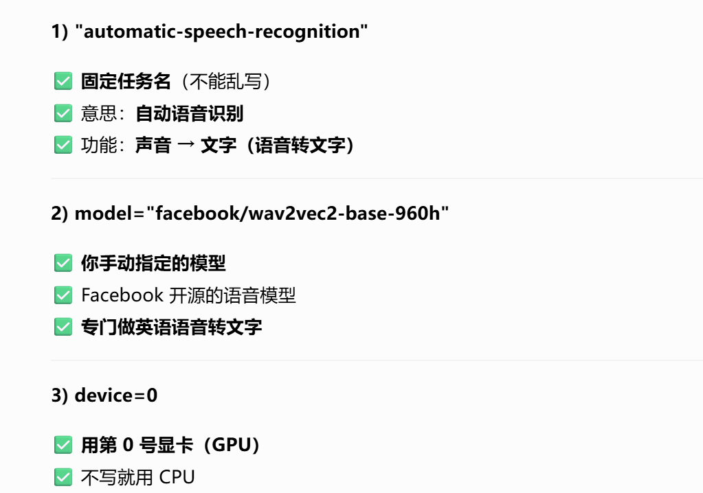

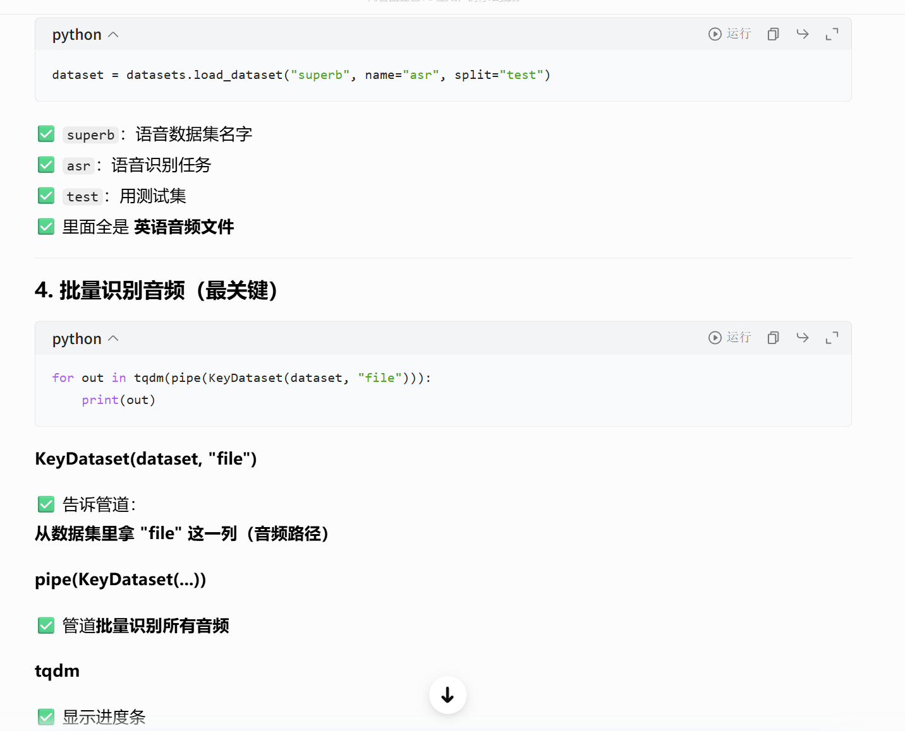

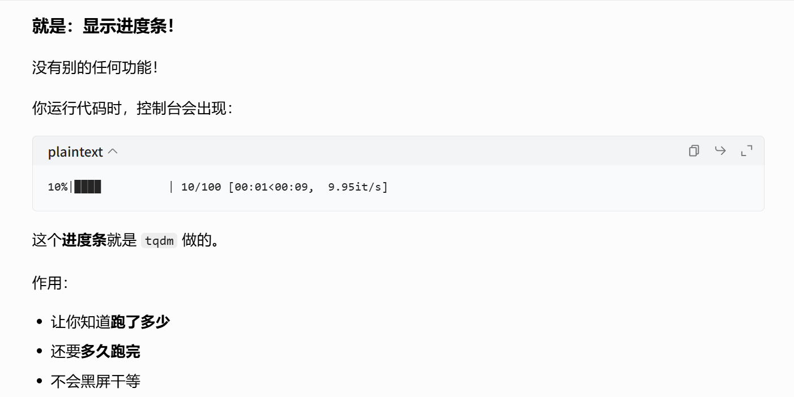

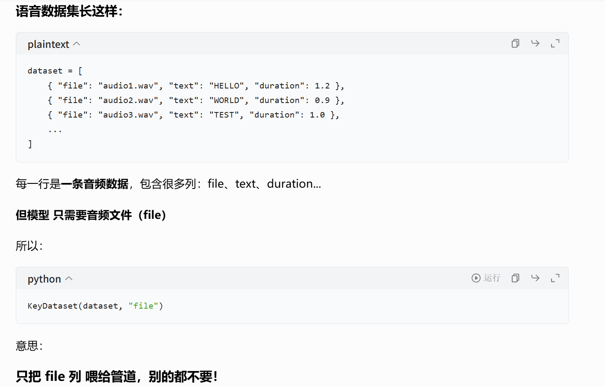

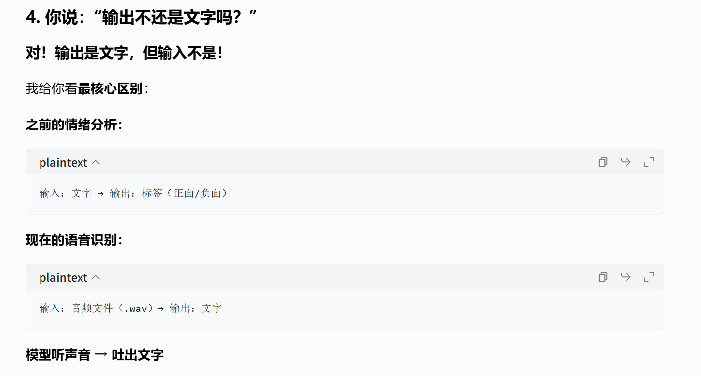

为了方便使用，也可以使用生成器

官方演示、

```
from transformers import pipeline

pipe = pipeline("text-classification")


def data():
    while True:
        # This could come from a dataset, a database, a queue or HTTP request
        # in a server
        # Caveat: because this is iterative, you cannot use `num_workers > 1` variable
        # to use multiple threads to preprocess data. You can still have 1 thread that
        # does the preprocessing while the main runs the big inference
        yield "This is a test"


for out in pipe(data()):
    print(out)
    # {"text": "NUMBER TEN FRESH NELLY IS WAITING ON YOU GOOD NIGHT HUSBAND"}
    # {"text": ....}
    # ....
```

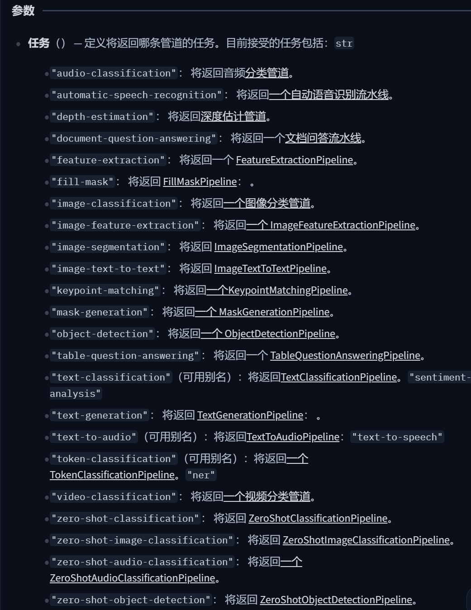

- **model**（或[PreTrainedModel](https://huggingface.co/docs/transformers/v5.9.0/en/main_classes/model#transformers.PreTrainedModel)，*可选*）—— 管道将用来做预测的模型。这可以是型号标识符或 预训练模型继承自[PreTrainedModel](https://huggingface.co/docs/transformers/v5.9.0/en/main_classes/model#transformers.PreTrainedModel)的实际实例。`str`

	

	如果没有提供，默认将被加载。`task`

- 

	**config**（或 [PreTrainedConfig](https://huggingface.co/docs/transformers/v5.9.0/en/main_classes/configuration#transformers.PreTrainedConfig)，*可选*）— 流水线将用来实例化模型的配置。这可以是一个模型 标识符或继承自[PreTrainedConfig](https://huggingface.co/docs/transformers/v5.9.0/en/main_classes/configuration#transformers.PreTrainedConfig)的实际预训练模型配置。`str`

	

	如果未提供，将使用所请求型号的默认配置文件。这意味着如果给出了，就会使用其默认配置。但如果没有提供，则会使用该默认型号的配置。`model``model``task`

- 

	**分词器**（或称[预训练分词器](https://huggingface.co/docs/transformers/v5.9.0/en/main_classes/tokenizer#transformers.PythonBackend)，*可选*）—— 流水线将用来编码模型数据的分词器。这可以是一个模型 或者是继承自[PreTrainedTokenizer](https://huggingface.co/docs/transformers/v5.9.0/en/main_classes/tokenizer#transformers.PythonBackend)的实际预训练分词器。`str`

	

	如果未提供，则会加载给定的默认标记器（如果是字符串）。如果未指定或不是字符串，则加载默认分词器（如果是字符串）。 然而，如果 也没有给定或不是字符串，那么 给定的默认分词器将被加载。`model``model``config``config``task`

- 

	**feature_extractor**（或 [FeatureExtractionMixin](https://huggingface.co/docs/transformers/v5.9.0/en/main_classes/feature_extractor#transformers.FeatureExtractionMixin)，*可选*）—— 该特征提取器将被流水线用于为模型编码数据。这可以是一个模型 识别码或继承自 [FeatureExtractionMixin](https://huggingface.co/docs/transformers/v5.9.0/en/main_classes/feature_extractor#transformers.FeatureExtractionMixin) 的实际预训练特征提取器。`str`

	

	特征提取器用于非自然语言处理模型，如语音模型或视觉模型以及多模态模型 模特。多模态模型还需要通过分词器。

	如果未提供，则会加载该特征的默认特征提取器（如果是字符串）。如果未指定或不是字符串，则默认的特征提取器会被加载（如果 是字符串）。然而，如果 也没有给定或不是字符串，那么默认的特征提取器 因为给定的将被加载。`model``model``config``config``task`

- 

	**image_processor**（或[BaseImageProcessor](https://huggingface.co/docs/transformers/v5.9.0/en/main_classes/image_processor#transformers.BaseImageProcessor)，*可选*）—— 流水线将用于模型图像预处理的图像处理器。这可以是一个 型号标识符或继承自[BaseImageProcessor](https://huggingface.co/docs/transformers/v5.9.0/en/main_classes/image_processor#transformers.BaseImageProcessor)的实际图像处理器。`str`

	

	图像处理器用于视觉模型和需要图像输入的多模态模型。多模态 模型还需要通过分词器。

	如果未提供，则会加载该图像的默认图像处理器（如果是字符串）。如果未指定或不是字符串，则加载默认图像处理器（如果是 一串）。`model``model``config`

- 

	**处理器**（或 [ProcessorMixin](https://huggingface.co/docs/transformers/v5.9.0/en/main_classes/processors#transformers.ProcessorMixin)，*可选*）—— 流水线将用于模型数据预处理的处理器。这可以是一个模型 标识符或继承自[ProcessorMixin](https://huggingface.co/docs/transformers/v5.9.0/en/main_classes/processors#transformers.ProcessorMixin)的实际处理器。`str`

	

	处理器用于需要多模态输入的多模态模型，例如，一个模型 需要同时输入文本和图片。

	如果未提供，则会加载该处理器的默认处理器（如果是字符串）。如果未指定或不是字符串，则加载默认处理器（如果是字符串）。`model``model``config`

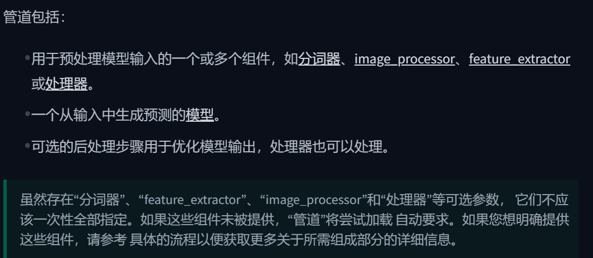

tokenizer分词器

processor处理器

```
# from transformers import pipeline,AutoModelForTokenClassification,AutoTokenizer
# analyzer=pipeline("sentiment-analysis")

# model = AutoModelForTokenClassification.from_pretrained("dbmdz/bert-large-cased-finetuned-conll03-english")
# tokenizer = AutoTokenizer.from_pretrained("google-bert/bert-base-cased")
# recognizer = pipeline("ner", model=model, tokenizer=tokenizer)

# 流水线批处理
from transformers import pipeline
from transformers.pipelines.pt_utils import KeyDataset
import datasets
dataset=datasets.load_dataset("imab",name="plain_text",split="unsupervised")

pipe=pipeline("text-classification",device=0)

for out in pipe(KeyDataset(dataset,"text"),batch_size=8,truncation="only_first"):
    print(out)
    # [{'label': 'POSITIVE', 'score': 0.9998743534088135}]
    # Exactly the same output as before, but the content are passed
    # as batches to the model

```

然而，这并不意味着性能本身就有利。它可能加速10倍，也可以是5倍减速，视情况而定 无论是硬件、数据还是实际使用的模型。

举个主要加速的例子：

```
from transformers import pipeline
from torch.utils.data import Dataset
from tqdm.auto import tqdm

pipe=pipeline("text-classification",device=0)

class MyDataset(Dataset):
	def __len__(self):
		return 5000
		
	def __getitem__(self,i):
		return "this is a test"
dataset=MyDataset()

for batch_size in [1,864,256]:
	print("-"*30)
	print(f"Streaming batch_size={batch_size}")
    for out in tqdm(pipe(dataset, batch_size=batch_size), total=len(dataset)):
        pass
```

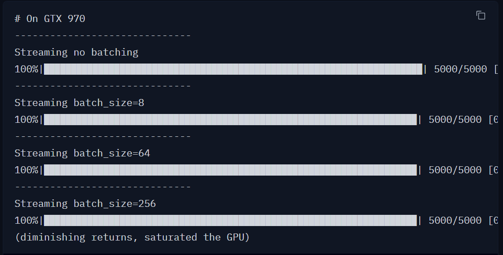

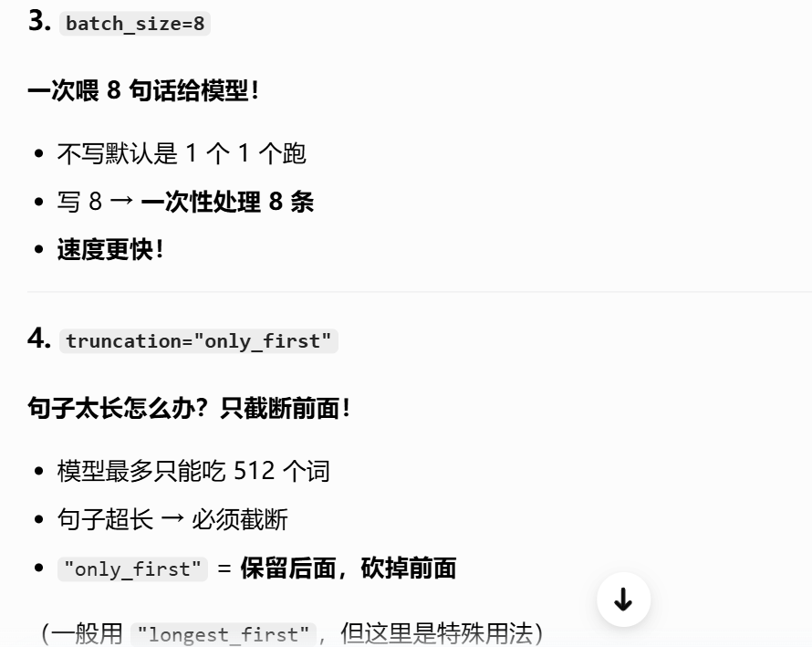

举个最明显的慢速例子：

```
class MyDataset(Dataset):
    def __len__(self):
        return 5000
    def __getitem__(self, i):
        if i % 64 == 0:
            n = 100
        else:
            n = 1
        return "This is a test" * n
```

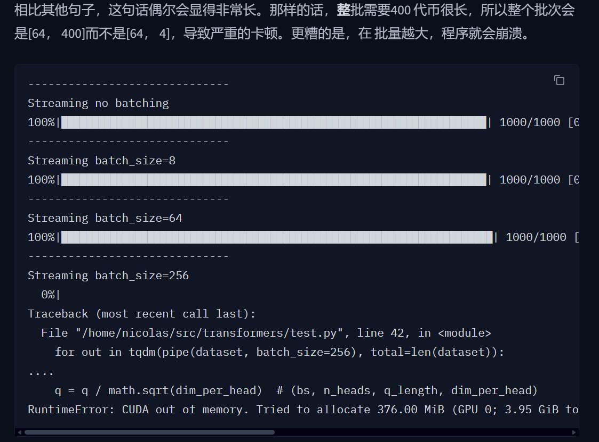

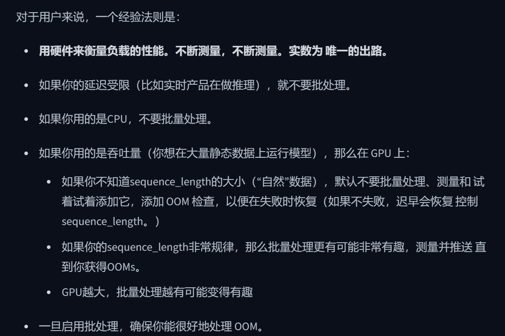


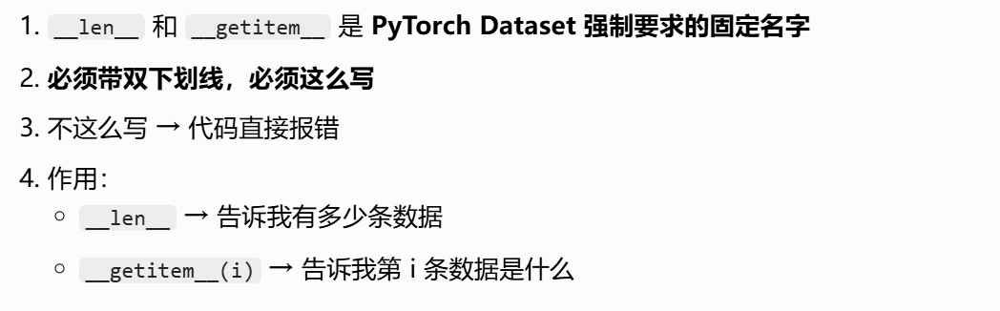

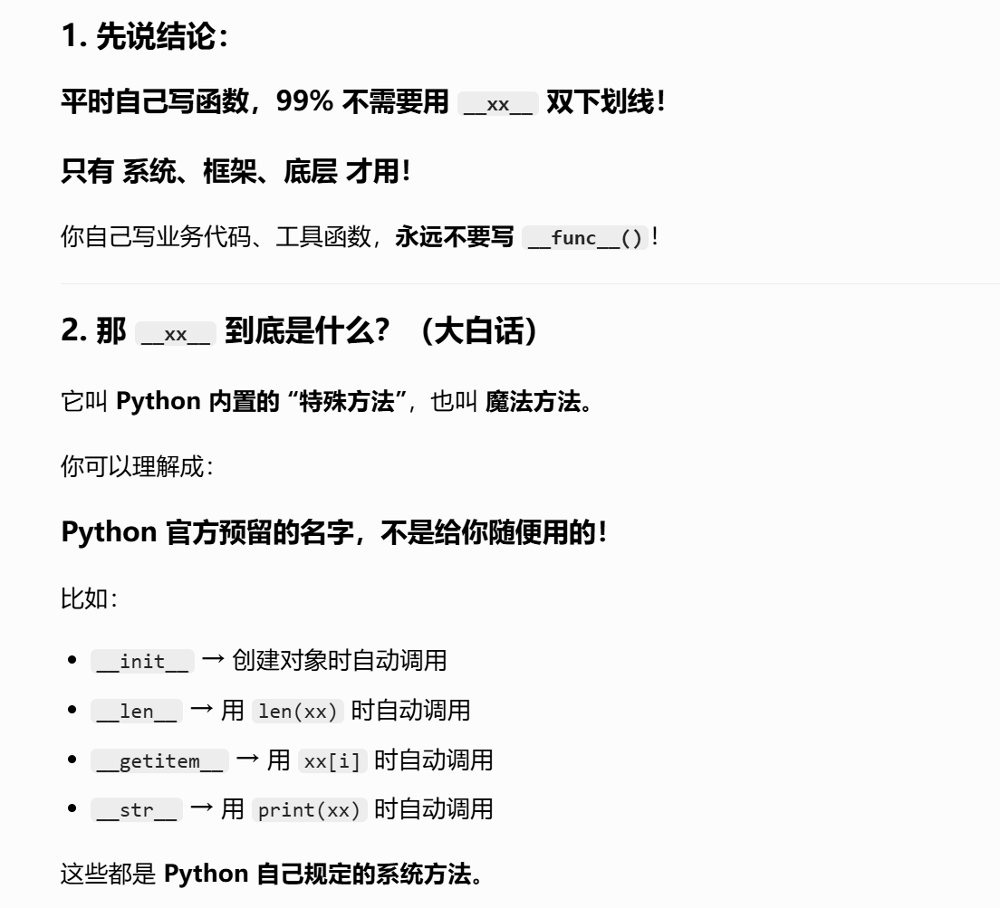

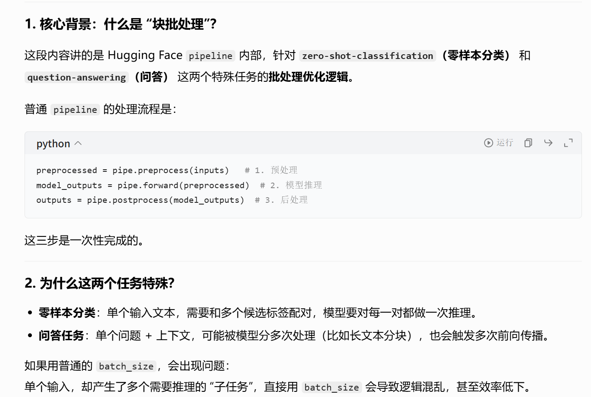

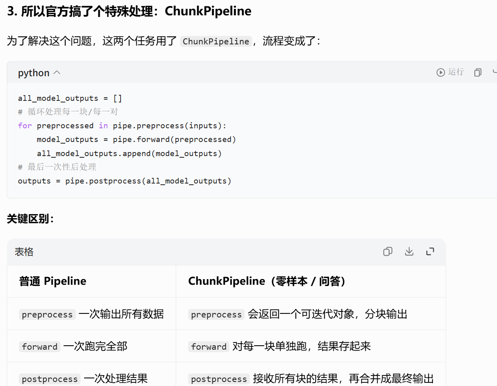

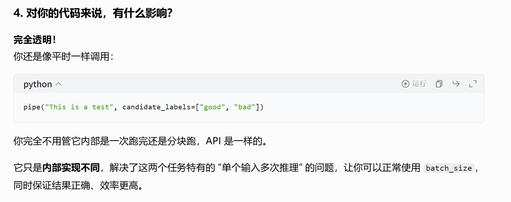

### 流水线自定义代码

```
class MyPipeline(TextClassificationPipeline):
	def postprocess():
		scores=scores*100
my_pipeline=MyPpeline(model=model,tokenizer=tokenizer,...)

#or

my_pipeline=pipeline(model="xxx"npipeline_class=Mypipeline)
```

### 音频

( *args**kwargs )

- **模型**（[预训练模型](https://huggingface.co/docs/transformers/v5.9.0/en/main_classes/model#transformers.PreTrainedModel)）—— 管道将用来做预测的模型。这需要是一个继承自[PreTrainedModel](https://huggingface.co/docs/transformers/v5.9.0/en/main_classes/model#transformers.PreTrainedModel)的模型。
- **feature_extractor**（[序列特征提取器](https://huggingface.co/docs/transformers/v5.9.0/en/main_classes/feature_extractor#transformers.SequenceFeatureExtractor)）—— 该特征提取器将被流水线用于为模型编码数据。该对象继承自 [SequenceFeatureExtractor](https://huggingface.co/docs/transformers/v5.9.0/en/main_classes/feature_extractor#transformers.SequenceFeatureExtractor)。
- **任务**（，默认为）—— 管道的任务标识符。`str``""`
- **num_workers**（*可选*，默认为8）—— 当流水线使用 *DataLoader*（在 GPU 上传输数据集以处理 Pytorch 模型）时，数量为 工人被利用。`int`
- **batch_size**（*可选*，默认为1）—— 当流水线使用 *DataLoader*（在 GPU 上传输 Pytorch 模型的数据集时），大小为 使用批次，推断这并不总是有益，请阅读[批处理 管道](https://huggingface.co/transformers/main_classes/pipelines.html#pipeline-batching)。`int`
- **args_parser**（[ArgumentHandler](https://huggingface.co/docs/transformers/v5.9.0/en/internal/pipelines_utils#transformers.pipelines.ArgumentHandler)，*可选*）— 指负责解析提供管道参数的对象。
- **设备**（*可选*，默认为-1）—— 设备序数用于CPU/GPU支持。将此值设为-1会利用CPU，正值则运行模型 关联的CUDA设备ID。你可以通过母语或太`int``torch.device``str`
- **dtype**（或，*可选*）—— 直接发送（只是简化的捷径）以利用该模型可用的精度 (, , …或`str``torch.dtype``model_kwargs``torch.float16``torch.bfloat16``"auto"`)
- **binary_output**（*可选*，默认为）—— 标志指示流水线输出应以序列化格式（即 pickle）或 原始输出数据，例如文本。`bool``False`

使用任意音频分类流水线。该流水线预测 的类别 原始波形或音频文件。对于音频文件，应安装ffmpeg以支持多音频 格式。`AutoModelForAudioClassification`

```
from transformers import pipeline

classifier = pipeline(model="superb/wav2vec2-base-superb-ks")
result=classifier("https://huggingface.co/datasets/Narsil/asr_dummy/resolve/main/1.flac")
print(result)

[{'score': 0.997, 'label': '_unknown_'}, {'score': 0.002, 'label': 'left'}, {'score': 0.0, 'label': 'yes'}, {'score': 0.0, 'label': 'down'}, {'score': 0.0, 'label': 'stop'}]
```

### 自动语音识别流水线

- **模型**（[预训练模型](https://huggingface.co/docs/transformers/v5.9.0/en/main_classes/model#transformers.PreTrainedModel)）—— 管道将用来做预测的模型。这需要是一个继承自[PreTrainedModel](https://huggingface.co/docs/transformers/v5.9.0/en/main_classes/model#transformers.PreTrainedModel)的模型。
- **feature_extractor**（[SequenceFeatureExtractor](https://huggingface.co/docs/transformers/v5.9.0/en/main_classes/feature_extractor#transformers.SequenceFeatureExtractor)，*可选*）—— 该特征提取器将被管线用于为模型编码波形。
- **分词器**（[PreTrainedTokenizer](https://huggingface.co/docs/transformers/v5.9.0/en/main_classes/tokenizer#transformers.PythonBackend)，*可选*）—— 流水线将用来编码模型数据的分词器。该对象继承自[PreTrainedTokenizer](https://huggingface.co/docs/transformers/v5.9.0/en/main_classes/tokenizer#transformers.PythonBackend)。
- **解码器**（*可选*）— [PyCTCDecode 的 BeamSearchDecoderCTC](https://github.com/kensho-technologies/pyctcdecode/blob/2fd33dc37c4111417e08d89ccd23d28e9b308d19/pyctcdecode/decoder.py#L180)可通过用于语言模型增强解码。更多信息请参见[Wav2Vec2ProcessorWithLM](https://huggingface.co/docs/transformers/v5.9.0/en/model_doc/wav2vec2#transformers.Wav2Vec2ProcessorWithLM)。`pyctcdecode.BeamSearchDecoderCTC`
- **装置**（Union[， ]，*可选*）—— 设备序数用于CPU/GPU支持。将此设置为 将利用 CPU，正极将运行 模型在关联的CUDA设备ID上。`int``torch.device``None`

旨在提取部分音频中的语音文本的管道。

输入可以是原始波形或音频文件。对于音频文件，应安装 ffmpeg 以实现 支持多种音频格式

除非你用的模型在配置文件中明确设置了这些生成参数 （），将使用以下默认值：`generation_config.json`

- max_new_tokens：256
- num_beams：5

```
from transformers import pipeline

transcriber = pipeline(model="openai/whisper-base")
result=transcriber("https://huggingface.co/datasets/Narsil/asr_dummy/resolve/main/1.flac")
print(result)

{'text': ' He hoped there would be stew for dinner, turnips and carrots and bruised potatoes and fat mutton pieces to be ladled out in thick, peppered flour-fatten sauce.'}
```

### TextToAudioPipeline

( *args,vocoder = None,sampling_rate = None,**kwargs )

文本转音频生成流水线，使用任意或 。就是这样 管道从输入文本及可选的其他条件输入生成音频文件。`AutoModelForTextToWaveform``AutoModelForTextToSpectrogram`

除非你用的模型在配置文件中明确设置了这些生成参数 （），将使用以下默认值：`generation_config.json`

- max_new_tokens：256

```
from transformers import pipeline

pipe = pipeline(model="suno/bark-small")
output = pipe("Hey it's HuggingFace on the phone!")

audio = output["audio"]
sampling_rate = output["sampling_rate"]
```

```
from transformers import pipeline

music_generator = pipeline(task="text-to-audio", model="facebook/musicgen-small")

generate_kwargs = {
	#不用贪心解码，用随机采样
    "do_sample": True,
    #温度 / 随机性
    "temperature": 0.7,
    #生成多少个音频 token
    "max_new_tokens": 35,
}

outputs = music_generator("Techno music with high melodic riffs", generate_kwargs=generate_kwargs)
```

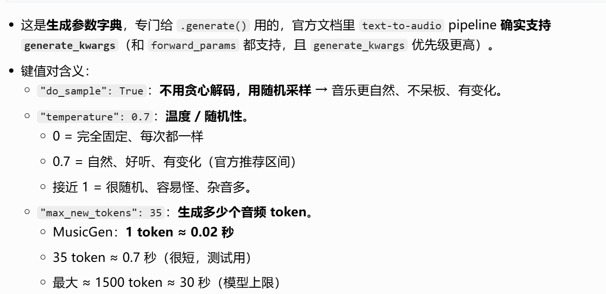

### 零射击音频分类流程

```
from transformers import pipeline
from datasets import load_dataset

dataset=load_dataset()
audio=next(iter(dataset["trian"]["audio"]))["array"]
classifier=pipeline(task="",model="")
result=classifier(audio,candidate_labels="")
```

## 处理器

处理器在变形金刚库中可以有两种不同的含义：

- 为多模态模型（如[Wav2Vec2](https://huggingface.co/docs/transformers/model_doc/wav2vec2)，语音和文本）预处理输入的对象 或[CLIP](https://huggingface.co/docs/transformers/model_doc/clip)（文本与视觉）
- 被弃用的对象，这些对象在旧版本的库中用于预处理GLUE或SQUAD的数据。

## Quantization

量化技术通过用更低精度的数据类型（如8位整数）表示权重和激活，降低了内存和计算成本。这使得加载通常无法放入内存的大模型成为可能，并加快了推理速度。Transformers 支持 AWQ 和 GPTQ 量化算法，并支持 8 位和 4 位的 bitsandbytes 量化。


## 分词器

分词器负责准备模型的输入。该库包含所有模型的分词器。大多数 其中分词器有两种版本：完整的 Python 实现和基于 Rust 库[🤗的标记器](https://github.com/huggingface/tokenizers)。“快速”实现允许：

1. 尤其是在批量分化分组时，速度显著提升
2. 还有其他方法可以映射原始字符串（字符和单词）与令牌空间（例如获得 包含给定字符的标记索引或对应给定标记字符的跨度）。

## Trainer

[Trainer](https://huggingface.co/docs/transformers/v5.9.0/en/main_classes/trainer#transformers.Trainer) 类为 PyTorch 功能完整性训练提供了 API，支持多 GPU/TPU 分布式训练，NVIDIA [GPU](https://nvidia.github.io/apex/) 混合精度训练，AMD [GPU](https://rocm.docs.amd.com/en/latest/rocm.html) 支援 [`torch.amp 支援 PyTorch`](https://pytorch.org/docs/stable/amp.html)。[Trainer](https://huggingface.co/docs/transformers/v5.9.0/en/main_classes/trainer#transformers.Trainer) 与 [TrainingArguments](https://huggingface.co/docs/transformers/v5.9.0/en/main_classes/trainer#transformers.TrainingArguments) 课程相辅相成，后者提供多种自定义模型训练方式的选项。这两个类别共同提供了完整的训练API。

## DeepSpeed2

[DeepSpeed](https://github.com/deepspeedai/DeepSpeed) 由零冗余优化器（ZeRO）驱动，是一款用于训练和拟合超大型模型到 GPU 上的优化库。它有多个 ZeRO 阶段，每个阶段通过划分优化器状态、梯度、参数，并支持向 CPU 或 NVMe 卸载，逐步节省更多 GPU 内存。DeepSpeed与[训练师](https://huggingface.co/docs/transformers/v5.9.0/en/main_classes/trainer#transformers.Trainer)课程集成，大部分设置都会自动帮你完成。

## ExecuTorch

[`ExecuTorch`](https://github.com/pytorch/executorch) 是一款端到端解决方案，用于实现移动设备和边缘设备（包括可穿戴设备、嵌入式设备和微控制器）的设备端推理能力。它是 PyTorch 生态系统的一部分，支持部署 PyTorch 模型，重点关注可移植性、生产力和性能。

## 特征提取器 Feature Extractor

特征提取器负责为音频模型准备输入特征。这包括从序列中提取特征，例如预处理音频文件以生成Log-Mel频谱图特征，以及转换为NumPy和PyTorch张量。

## 图像处理器 Image Processor

图像处理器负责加载图像（可选）、为视觉模型准备输入特征以及对输出进行后期处理。这包括调整大小、归一化以及转换为PyTorch和Numpy张量等变换。它也可能包含模型特定的后处理，比如将logit转换为分割掩码。

## 视频处理器 Video Processor

**视频处理器**是一种工具，负责为视频模型准备输入特征，并处理其输出的后期处理。它提供诸如调整大小、归一化以及转换为 PyTorch 等转换功能。在第一种变换过程中，该类处理从本地路径或URL进行视频解码（需要 [`torchcodec`](https://pypi.org/project/torchcodec/)https://pypi.org/project/torchcodec/)）和根据模型特定策略进行帧采样。`VideoProcessor`

## 核 Kernels

### KernelConfig

( kernel_mapping = Noneuse_local_kernel = False )

## 环境变量

### HF_ENABLE_PARALLEL_LOADING

默认情况下，这个选项是被禁用的。启用后，允许在模型初始化时并行加载Torch和Safetensor权重文件。这可以显著减少加载大型多分片模型所需的时间，通常在支持的环境中实现约50%的加速。

在承诺使用该环境变量之前先进行配置文件，这不会为较小模型带来加速。

```
import os
os.environ["HF_ENABLR_PARALLEL_LOADING"]="true"

from transformers import pipeline
model=pipeline(task="text-generation",model="facebook/ope-30b",device_map="auto")
```

### HF_PARALLEL_LOADING_WORKERS

确定启用并行加载时应使用多少线程。默认是。`8`

如果加载的文件数量少于指定线程数，实际生成的文件数量将等于文件数量。

例如，如果你指定8个工人，但只有2个文件，那么只会生成2个工人。


```
import os
os.environ["HF_ENABLE_PARALLEL_LOADING"] = "true"
os.environ["HF_PARALLEL_LOADING_WORKERS"] = "4"

from transformers import pipeline
model=pipeline(task="text-generation",model="facebook/opt-30b", device_map="auto")
```

